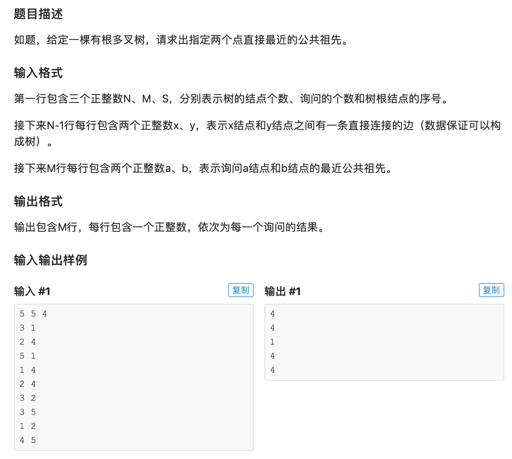

* 这是一道倍增的蓝题，非常难，细节很多，中间挺多地方需要推公式。其实倍增本质上也是Divide & Conquer。这道题首先要做的一件事就是用一个数组anc[i][j]存上节点i往上数2的j次方层的节点。当一个query问我们两个节点的最近公共祖先的时候，首先把这两个节点倍增地翻到同一个深度，然后用类似二分的方法往上找祖先。为什么说像二分呢？就是步长是每次减半的。首先第一次直接回到根，也就是最远公共祖先，如果相同，说明根下面的层中还有可能有公共祖先，因此就再往下看。如果往下看的时候发现某一层两个节点的祖先不一样了，说明我们走大了，最近公共祖先肯定在上面，因此把两个节点往上翻。最后一点一点减少，一直走到最近公共祖先的下一层。
* 注意这道题的数据量还是很大的，采用两种方式降低复杂度。首先，用lg预处理存上logi, 避免反复计算对数。再一个就是不要用数组存query。一边读一边动态输出。实验证明非动态输出会TLE， 而动态输出则不会。

* AC 代码

```c
#include <iostream>
#include <cstdio>
#include <vector>
#include <stack>
#include <utility>
#include <cstring>
#define maxn 500005

using namespace std;

int n,m,s;
vector<int> adj[maxn];
int lg[maxn], depth[maxn];

// anc[i][j]表示的是i节点往上数2的j次方层的祖先
int anc[maxn][30];

void init(){
	//邻接表存图
	scanf("%d%d%d", &n, &m, &s);
	for(int i = 1; i <= n-1; i++){
		int x,y; scanf("%d%d", &x, &y);
		adj[x].push_back(y); adj[y].push_back(x);
	}
}

void compute_lg(){
	// 预处理，使后面的计算变得更快
	// 得到的是  向下取整（log_2 i）
	lg[0] = -1;
	for(int i = 1; i <= maxn; i++){
		lg[i] = lg[i>>1] + 1;
	}
}

void dfs(int f, int pred){
	//更新深度
	depth[f] = depth[pred] + 1;
	//2的0次方层（1层）祖先就是pred
	anc[f][0] = pred;

	//通过转移计算祖先, 算法的核心逻辑之一
	for(int i = 1; (1<<i)<=depth[f]; ++i){
		anc[f][i] = anc[anc[f][i-1]][i-1];
	}

	//递归继续往下dfs
	for(int i = 0; i < adj[f].size(); i++){
		if(adj[f][i] != pred){
			dfs(adj[f][i], f);
		}
	}
}	

// Least Common Ancestor核心算法
int lca(int a, int b){
	//我们需要定a的深度小于b，如果不是swap一下，方便我们后面的计算
	if(depth[a] > depth[b]) swap(a, b);

	//如果个节点深度不一样，我们把深的那个节点往上移，直到和浅的那个同层，再开始一起跳，这样可以避免犯错
	while(depth[a] != depth[b])
		b = anc[b][lg[(depth[b]-depth[a])]];

	//如果同层的话两个一样，就不能继续跳了，说明其中一个是另一个的祖先，所以返回其中一个即可
	if(a==b)return a;

	//从最根层开始，如果相等，过，走下一个深度
	//如果不想等，把两个节点往上翻
	//可以在一个有两个长链的树上trace一下，可以方便理解
	//注意这里是没有break的，最后会把a b翻到最近公共祖先的下一层，所以最后返回2的0次方祖先，即上一层，就是最终答案
	//相当于是一个对ancestor的divide&conquer，如果找到公共祖先，那么得寸进尺一下，k减半，如果祖先不等了，说明我们确实得寸进尺了，所以把两个a b翻上去
	for(int k = lg[depth[a]]; k >=0; k--)
		if(anc[a][k]!=anc[b][k])
			a = anc[a][k], b = anc[b][k];	
	return anc[a][0];
}


int main(){
	init();
	compute_lg();

	//开始dfs，给一个虚拟节点0，深度是0，所以起始点的深度是1
	dfs(s,0);

	// 动态输出
	for(int i = 1; i <= m; i++){
		int x,y; scanf("%d%d", &x, &y);
		int ans = lca(x,y);
		printf("%d\n", ans);
	}
	return 0;
}
```