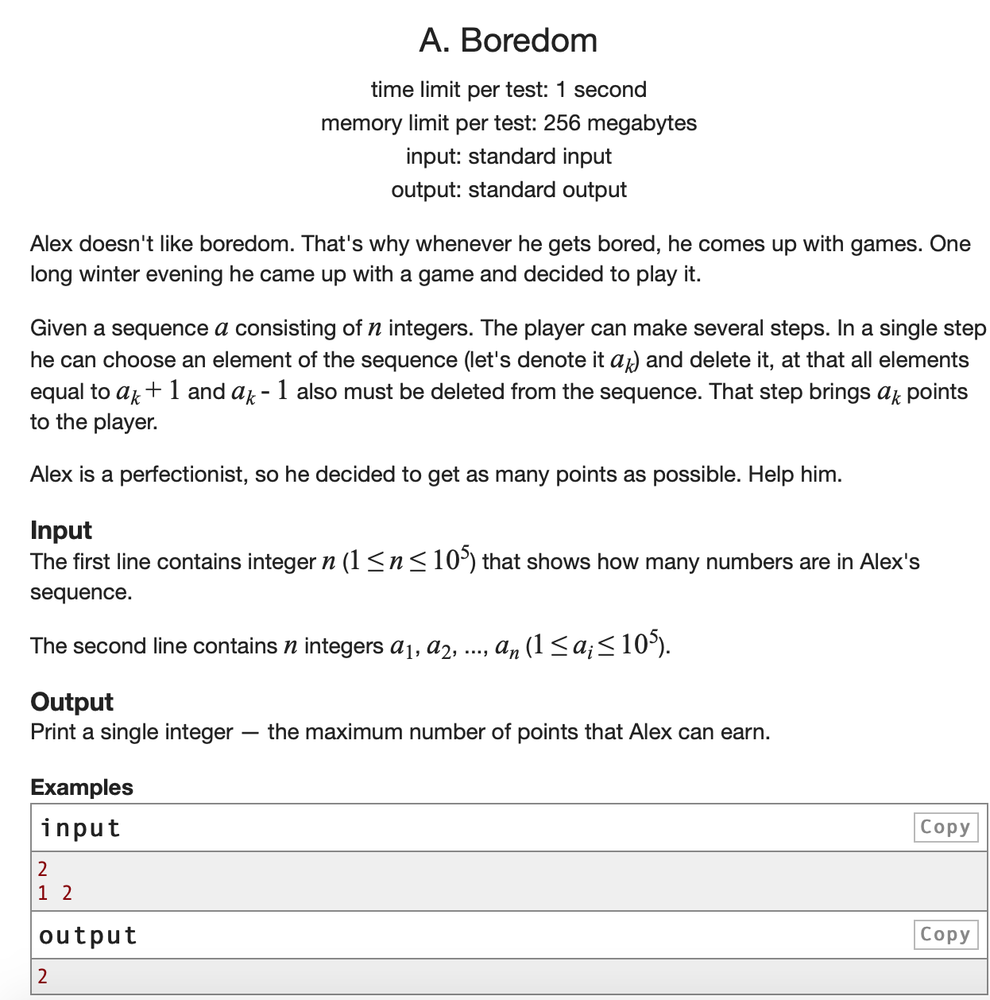

* 这是一道非常简单的dp，但是想复杂了。这道题没想到的一个点就是dp跑的应该是所有numbers，然后用cnt数组数每个数出现的次数即可。想到了先sort一下然后再跑，其实也可以，但是麻烦，因为如果一个数可以选，那么所有的重复都可以选，所以直接用乘法即可

* AC 代码

```c
#include <iostream>
#include <cstdio>
#include <algorithm>
#include <vector>
#include <set>
#include <cstring>
#define maxn 100005

using namespace std;
int n, cnt[maxn], f[maxn],mx=-1;

void init(){
	scanf("%d", &n);
	for(int i = 1; i <= n; i++){
		int t;
		scanf("%d", &t);
		mx = max(mx, t);
		cnt[t]++;
	}
}


//Dynamic Programming Function
void dp(){
	//base case
	f[1] = cnt[1];
	for(int i = 2; i <= n; i++){
		f[i] = max(f[i-1], f[i-2] + cnt[i]*i);
	}
}

int main(){
	init();
	dp();
	cout << f[mx] << endl;
	return 0;
}
```

