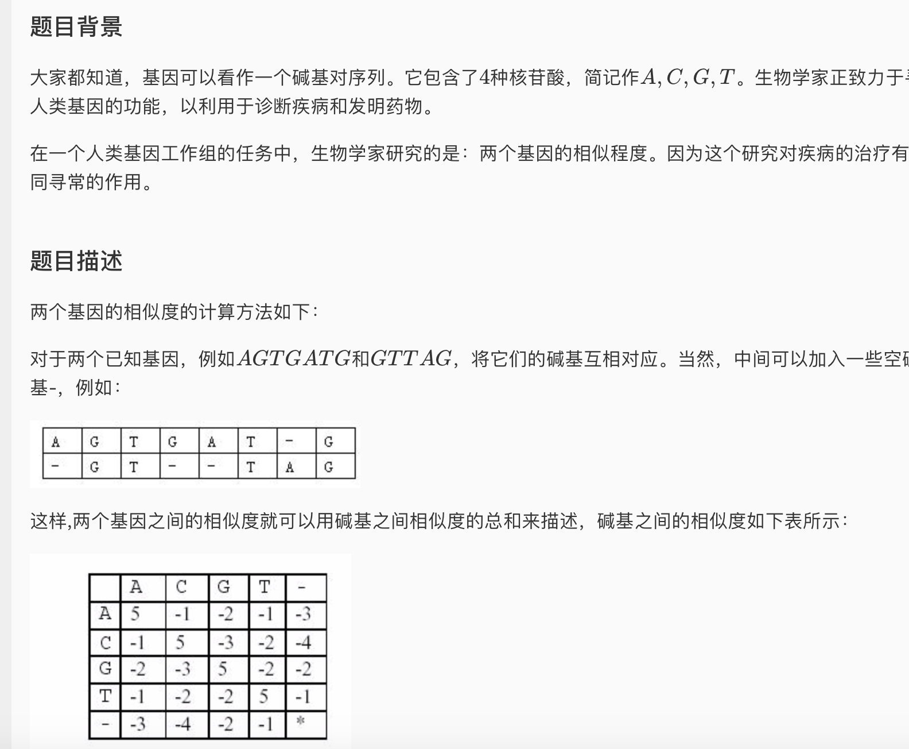
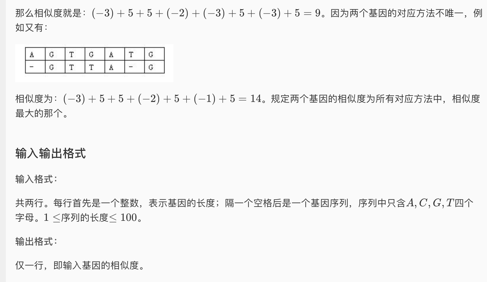

* 题目描述

* 这道题和 luogu\_p1279的思路几乎完全一样，都是属于Sequence Alignment那一类的动态规划题目。但是这道题目的一个特殊之处导致我交了一次没过，反思修改后过了，补上了luogu\_p1279中的一个思路遗漏。以下就是这个遗漏：
  * 在luogu\_p1279中，空格和任何字母的距离都是一个定值k。所以在进行状态转移的时候f[i-1][j], f[i][j-1]都是加上k就可以了，不会弄错。但是在这道题中，“空碱基”和其它非空碱基的距离都是不一样的，所以如果弄错了f[i-1][j], f[i][j-1]之后加的数值就会导致答案错误。我的第一次WA就是这么造成的。下面我们来把这个概念捋清楚。
  * 在所有Sequence Alignment这一类动态规划问题中，f[i][j]代表的意义是“第一个字符串考虑到i，第二个字符串考虑到j的最优值。” 而不是“第一个字符串a以a[i]结尾，第二个字符串以b[j]结尾的时候的最优值。”这一点一定要弄明白。
    * 举个例子，在这一题中，假设 a = “AGTTG” b=“CGC”，那么f[3][1]中储存的数据的意义应该是a考虑到a[3], b考虑到b[1]时候的最优解。这个解所表示的具体扩展方式我们并不知道是什么我们只知道它是最优值，反正是两个长度相等的扩展串，比如可能是.
      * A 空 G T 空 T
      * 空 空 C 空 G 空
    * 因此，当我们进行状态转移的时候，比如现在要求f[3][2]，也就是b字符串要添加一个T的时候。我们知道最优解的扩展串的最后一位只有三种可能。
      * 以a当前考虑的最后一位 + 空格结尾
      * 以空格 + b当前考虑的最后一位结尾
      * 以a当前考虑的最后一位 + b当前考虑的最后一位结尾。
        * 详细来看 (还是用上面a b的例子)
        * 情况1
          * xxxxxT
          * xxxxx空
        * 情况2
          * xxxxx空
          * xxxxxC
        * 情况3
          * xxxxxT
          * xxxxxC
    * 最后一种情况是最好想的，我们只需要把考虑的位数a b都往前移一位就可以了，如果我们选择情况3，那么状态就转移到了f[i-1][j-1]+dist(’T’,’C’)
    * 容易搞混的就是情况1和情况2。对于情况1而已，如果我们用掉了a的最后一位，那么状态转移的时候a的“考虑到i位”中的i就应该往前移一位，因为最后一位被用掉了。对于情况2则同理应该把j往前移一位。我第一次提交把这两者搞混了。但是说到底还是dp数组每一位储存的状态的意义没有捋清楚。

* AC 代码

```c
#include <iostream>
#include <cstdio>
#include <string>
#include <cstring>
#include <algorithm>
#include <map>
#define maxn 105

using namespace std;

int n,m, f[maxn][maxn];
int sim[5][5] = {{5,-1,-2,-1,-3},{-1,5,-3,-2,-4},{-2,-3,5,-2,-2},{-1,-2,-2,5,-1},{-3,-4,-2,-1,-99999}};
char a[maxn],b[maxn];
map<char, int> mp;

int dist(char x, char y){
  //用于计算两个字符的距离，或者按照题目所说“两个碱基的相似度”
	return sim[mp[x]][mp[y]];
}

void init(){
	scanf("%d%s%d%s", &n, a+1, &m, b+1);
	a[0] = b[0] = ' '; n++; m++;
	mp.insert(make_pair('A',0));
	mp.insert(make_pair('C',1));
	mp.insert(make_pair('G',2));
	mp.insert(make_pair('T',3));
	mp.insert(make_pair(' ',4));
	f[0][0] = 0;
	for(int i = 1; i < m; i++){
		f[0][i] = dist(' ',b[i]) + f[0][i-1];
	}
	for(int i = 1; i < n; i++){
		f[i][0] = dist(' ',a[i]) + f[i-1][0];
	}
}


void dp(){
	for(int i = 1; i < n; i++){
		for(int j = 1; j < m; j++){
			f[i][j] = max(max(f[i-1][j] + dist(' ',a[i]), f[i][j-1] + dist(' ',b[j])), f[i-1][j-1] + dist(a[i],b[j]));
		}
	}
}

int main(){
	init();
	dp();
	cout << f[n-1][m-1];
	return 0;
}
```