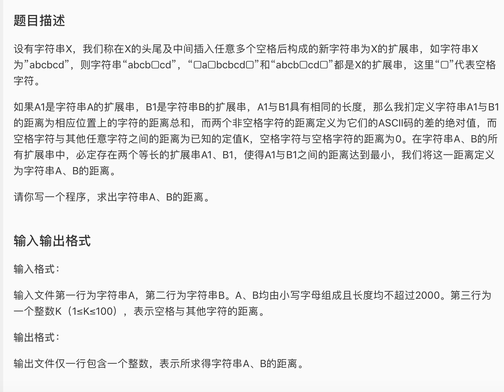

* 这道题其实就是经典dp题目Sequence Alignment的变式。但是由于我一开始没有看到“等长”这个条件，所以思路偏了，写出了一个可以算出正确答案但是超时的解（因为有3个循环）。如果这道题增加一个要求：需要长度最多为x的，距离最小的扩展串，那么我的解就是正确的。但是这题并没有这个要求。以后记住，如果input是1000级别的，那么三层循环一般会超时。
* 我的超时题解思路：
  * k的那一层循环用来循环长度。可以知道，k的范围是max(i,j) 到i+j。原因是
    * 最小值好理解，扩展串的长度最小也不可能小于两个原始字符串中最长的那一个的长度。
    * 最大值的原因，如果两个原始字符串被空格完全错开，那么扩展串再分距离不变，因为空格和空格的距离是0.
    * 综上，k的范围就得到了。
  * 之后通过最后一个位置的状态来进行转移。最后一个位置从上到下的状态分为四种情况
    * 空 空
    * 有 有
    * 空 有
    * 有 空
  * 注意加判断。
* 正确的思路
  * 和Sequence Aligntment一样，只不过这时候f中储存的是距离，增删改现在只有增这个选项。反而简化了。

* 我的超时代码

```c
/*
My attempt 1 to solve this problem.
TLE 50
*/

#include <cstring>
#include <string>
#include <cstdio>
#include <algorithm>
#include <cmath>
#include <climits>
#include <iostream>
#include <iomanip>
#define maxn 2005
using namespace std;
#define db cout << "Here" << endl;

char a[maxn], b[maxn];
int kt, f[2][maxn][maxn*2],m,n;

void init(){
	scanf("%s%s",a+1,b+1);
	a[0] = ' ';
	b[0] = ' ';
	m = strlen(a);
	n = strlen(b);
	scanf("%d", &kt);
}

// Compute distance
int dist(char a, char b){
	if(a == ' '|| b == ' '){
		if(a == ' '&& b == ' ') return 0;
		else return kt; 
	}else{
		return abs(a-b);
	}
}

int main(){
	init();
	int i,j;
	for(i = 0; i < m; i++){
		for(j = 0; j <n; j++){
			//k是slot数
			//slots从二者最大的开始，到两者的和
			int now = i%2;
			for(int k = max(i,j); k <= i+j; k++){
				int best = INT_MAX;
				if(i == 0 && j == 0) break;
				//总共应该分为四种情况
				if(i > 0 && j > 0){
					//上下都有
					best = min(best, f[now^1][j-1][i+j-2] + dist(a[i],b[j]));
				}
				if(i < k && j < k){
					//上下皆无
					best = min(best, f[now][j][k-1]);
				}
				if(i < k && j > 0){
					//上无下有
					best = min(best, f[now][j-1][i+j-1]+dist(' ',b[j]));
				}
				if(i > 0 && j < k){
					//上有下无
					best = min(best, f[now^1][j][i+j-1]+dist(a[i],' '));
				}
				f[now][j][k] = best;

			}
		}
	}

	cout << f[(i-1)%2][j-1][i+j-2] << endl;


	return 0;
}
```

* AC代码

```c
/*
My attempt 2 to solve this problem.
AC
*/

#include <cstring>
#include <string>
#include <cstdio>
#include <algorithm>
#include <cmath>
#include <climits>
#include <iostream>
#include <iomanip>
#define maxn 2005
using namespace std;
#define db cout << "Here" << endl;

char a[maxn], b[maxn];
int kt, f[maxn][maxn],m,n;

void init(){
	scanf("%s%s",a+1,b+1);
	a[0] = ' ';
	b[0] = ' ';
	m = strlen(a);
	n = strlen(b);
	scanf("%d", &kt);
}

// Computer distance
int dist(char a, char b){
	if(a == ' '|| b == ' '){
		if(a == ' '&& b == ' ') return 0;
		else return kt; 
	}else{
		return abs(a-b);
	}
}

int main(){
	init();

	for(int i = 0; i < m; i++){
		f[i][0] = i*kt;
	}
	for(int i = 0; i < n; i++){
		f[0][i] = i*kt;
	}
	for(int i = 1; i < m; i++){
		for(int j = 1; j <n; j++){
			//k是slot数
			//slots从二者最大的开始，到两者的和
			f[i][j] = min(f[i-1][j-1]+dist(a[i],b[j]), min(f[i-1][j], f[i][j-1])+kt);
		}
	}

	cout << f[m-1][n-1] << endl;


	return 0;
}
```