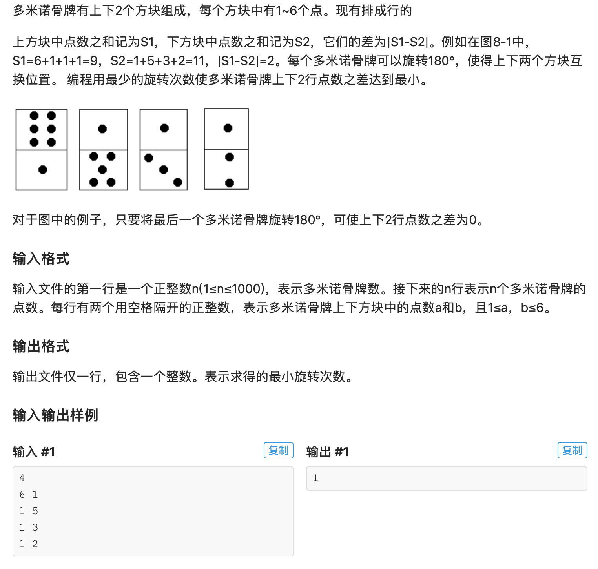

* 这是一道背包的蓝题，很难，我觉得可以称之为“抽象背包”。也就是说在这道题中，value，cost，甚至物品，都不明确，需要自己去找，且这道题的难点就是找到背包，价值，和花费。可能什么东西玩到高层都变成抽象的了吧。就比如向量空间到高端就不仅仅是真的字面意义上“向量”的空间了，向量可以代表任何东西，只要是线性的东西我们都可以抽象成向量，放到抽象向量空间中进行研究。背包玩到高层就变成了一种思想，脱离了具体的object, value, cost.

* 这道题的难点就是找到object，value，cost分别是什么。object应该是最好找的。毕竟我们要做的是选择旋转哪些骨牌，因此intuitively，“骨牌”，应该就是我们的object。那么value是什么呢？value貌似应该是让我们离目标更近的那个东西，在这个题中，如果我们翻转一个骨牌导致上下差值减小，那么就离我们的目的更近了，因此这道题中的value是翻转一个骨牌导致的点数差值减小值。cost应该是我们想尽量minimize的量，在这里应该是翻转骨牌的个数。所以cost应该就是翻转骨牌的个数。这道题中由于翻转一个骨牌可能产生负效果，也就是增大上下的差值。我们做一个特殊处理：读取数据的时候直接保证每张骨牌大的点数在上，如果遇到小点数在上的情况就直接先进行一步翻转。下次翻转这个骨牌的时候cost 就是-1。通过这一步预处理我们可以保证所有的value都是正数。然后就套背包的思想即可。这道题显然是一个01背包，用二维数组f[i][j]。 i表示考虑前i张骨牌。j代表什么呢？在一般的背包问题中j一般是代表cost上限，或者叫背包容量。这道题中如果我们用j代表背包容量，即翻转的骨牌总数，应该也是可以AC的，但是最后输出答案的时候可能会比较麻烦，需要先找到f[n][j]的最大值，如果有多个，在里面再取最小的j输出。我们这里玩一步不一样的操作，我们用j代表“取到总价值为j”，用f[i][j]代表“考虑前i个骨牌，取到的总价值为j的最小翻转数量。”但是这涉及到一个问题，就是考虑前i张骨牌不一定能取到j这个value。就比如考虑前0张骨牌怎么可能能取到10这个值呢？所以再用一个数组can[i][j]代表考虑前i张骨牌能否取到j这个value。

* AC 代码

```c
#include <iostream>
#include <cstring>
#include <algorithm>
#include <cstdio>
#include <vector>
#define maxn 1005

using namespace std;
//a数组存骨牌的点数
//sum 存上点数和与下点数和
//diff是预处理后上下点数和的差值，同时也是我们背包最大的value值
//f是dp数组
int n, a[maxn][2], sum[2], diff, cnt, f[maxn][maxn*6];
bool can[maxn][maxn*6];

//如果预处理中翻了骨牌i，f[i] = -1, 反之f[i] = 1
int flip[maxn]; 

//每个骨牌的value，即翻转带来的上下差值的减小值
int vl[maxn];

void init(){
	scanf("%d", &n);
	for(int i = 1; i <= n; i++) flip[i] = 1;
	for(int i = 1; i <= n; i++){
		int x,y; scanf("%d%d", &x, &y);
		if(x < y){
			// 大的在上小的在下
			a[i][0] = y; a[i][1] = x;
			sum[0] += y; sum[1] += x;
			flip[i] = -1;
			cnt++;
			vl[i] = 2*(y-x);
			continue;
		}
		sum[0] += x; sum[1] += y; 
		a[i][0] = x; a[i][1] = y;
		vl[i] = 2*(x-y);
	}
	diff = sum[0] - sum[1];
}

void dp(){
	//value: 翻转得到的差值减少, 想让value最大， value = diff我们就得到了0差值
	//cost: 1 -1 我们想让差值最小，初始cost为cnt，也就是已经翻转的骨牌数量，我们想让差值最小，最小为0，不可能再小，因为每个骨牌只能选一次
	
	//base case
	f[0][0] = cnt; 
	can[0][0] = true;
	
	
	for(int i = 1; i <= n; ++i){
		//考虑前i个骨牌（前i个物品）
		for(int j = 0; j <= diff; ++j){
			can[i][j] = true;
			if(j >= vl[i]){
				if(!can[i-1][j] && !can[i-1][j-vl[i]]){
					//两个都取不到
					can[i][j] = false;
					continue;
				}else if(!can[i-1][j]){
					f[i][j] = f[i-1][j-vl[i]] + flip[i];
				}else if(!can[i-1][j-vl[i]]){
					f[i][j] = f[i-1][j];
				}else{
					//两个都能取到
					f[i][j] = min(f[i-1][j],f[i-1][j-vl[i]] + flip[i]);
				}
			}else{
				if(!can[i-1][j]){
					can[i][j] = false;
					continue;
				}else{
					f[i][j] = f[i-1][j];
				}
			}
		}
	}
}

int main(){
	init();
	dp();
	for(int i = diff; i >= 0; i--){
		if(can[n][i]){
			cout << f[n][i];
			return 0;
		}
	}
	cout << "No Solution";
	return 0;
}
```