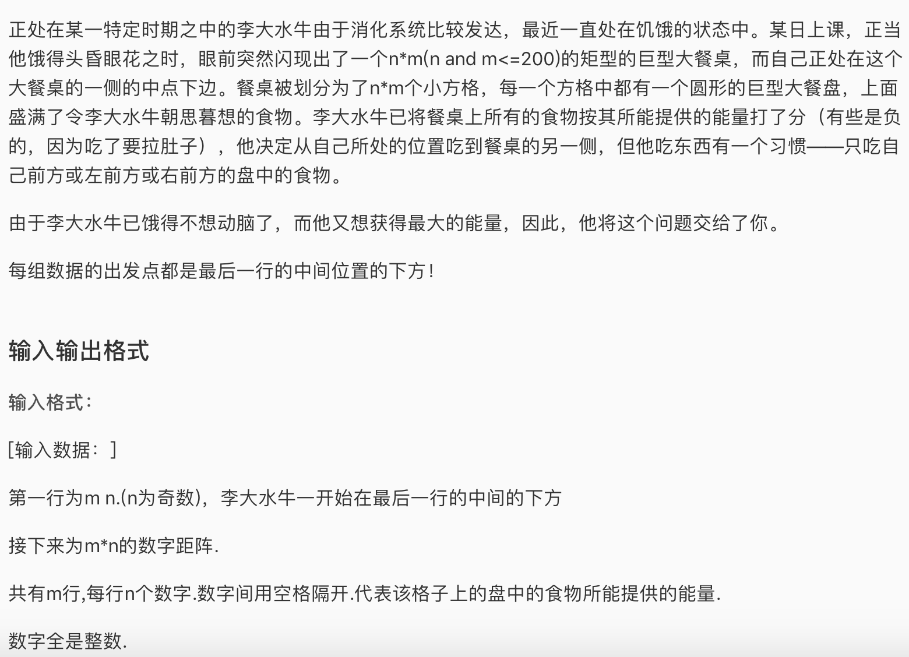

* 这道题是一道比较简单的dp，一遍就过了，不到20分钟。就是建立一个二维的和输入数据同样size的二维数组，填好最后一行的base case，然后往上走，同时进行转移即可。转移就是从下面左下，右下，下，中选最大。

* AC 代码

```c
#include <iostream>
#include <algorithm>
#include <cstring>
#include <climits>
#include <cstdio>
#define N 205
#define INF -2100000000

using namespace std;

int m,n, a[N][N], f[N][N], s;

void init(){
	scanf("%d%d",&m, &n); s = n/2;
	for(int i = 0; i < m; i++){
		for(int j = 0; j < n; j++){
			scanf("%d",&a[i][j]);
		}
	}
	//base case
	for(int i = 0; i < n; i++){
		if(i == s || i == s-1 || i == s+1){
			f[m-1][i] = a[m-1][i];
		}else{
			f[m-1][i] = INF;
		}
	}
}

void dp(){
	for(int i = m-2; i >= 0; i--){
		for(int j = 0; j < n; j++){
			int best = INF;
			if(j-1 >= 0) best = max(best, f[i+1][j-1] + a[i][j]);
			if(j+1 < n) best = max(best, f[i+1][j+1] + a[i][j]);
			best = max(best,f[i+1][j] + a[i][j]);
			f[i][j] = best;
		}
	}


}

int main(){
	init();
	dp();
	int ans = INF;
	for(int i = 0; i < n; i++){
		ans = max(ans, f[0][i]);
	}
	cout << ans;
	return 0;
}
```