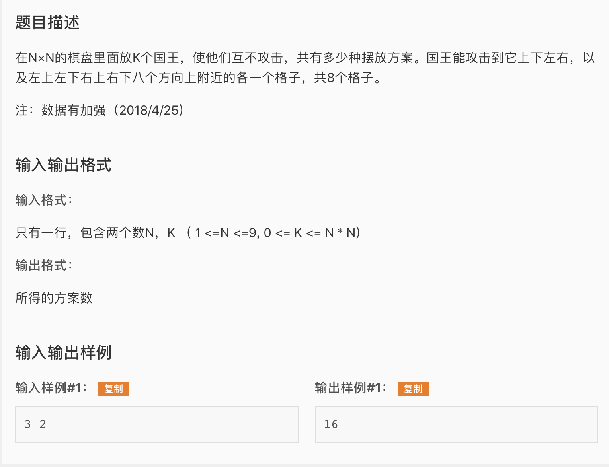

* ​`​`​一道蓝题，也是做的第一道状压dp的题。首先注意这道题中的棋子是king而不是queen。King只能攻击自己周围的八个格子，所以放置一个king对其它位置的约束很少，有很多很多放置的可能性，如果用8皇后的Backtrack search复杂度肯定会爆掉，所以这道题用的是状压dp。

* 状压dp一般就是指把其中的一维类似布尔数组的结构(有无有有无）用二进制表示再转化成十进制。这样用一个十进制数字就可以表示一整行的状态，这样我们就可以进行很方便的状态转移了。在这道题中，我们把棋盘中一整行的king的摆放方式压缩成一个二进制数。我们上来第一步先算出所有的状态，存在sts[]中，然后用一个ks[i]表示sts[i]中的国王数。这样我们的dp数组f[i][j][c]表示：考虑前i行，最后一行是j这个摆放方式(j被压缩成了一个数字), 且总共用c个国王的总方案数。状态转移的方式就是f[i][j][c] = sum for all states t , sum for all c where ks[j]≤c≤k {f[i-1][t][c]}。注意这里sum还有一个条件就是两行不冲突，只要不冲突我们就可以添加到方案数中。这个不冲突可以用一个很简单的办法实现，就是要么把第j个状态按位右移一位，要么把第t个状态按位左移一位，或者都不移，只要这三种情况中的任意一种的t j的按位与为非0说明有冲突。最后遍历所有最后一行的状态收集答案即可。

* AC 代码

```c
#include <iostream>
#include <algorithm>
#include <bitset>
#include <cstdio>
#include <cstring>
#include <stack>
#include <cstdlib>


using namespace std;
int n,k;
/*
This array stores all the possible states in a line
Notice that the number of states is for sure less than 2 to the 9th.(n <= 9)
Actual number would be much less than this since a king would fix the states
of its adjacenty nodes. 
*/
int sts[2000], cnt = -1;

//This array stores the number of kings in a particular line state
int ks[2000];

//dp array
long long f[10][2000][90];

//Generate all possible states
void dfs(int deci, int sum, int curr){
	//decimal is the decimal number of this state
	//sum is the sum of kings in this state
	//curr is the current block we are at 
	if(curr >= n){
		//Find a new state
		sts[++cnt] = deci;
		ks[cnt] = sum;
		return;
	}
	//Place king in this block or skip this block

	//Place a king
	dfs(deci, sum, curr+1);
	dfs(deci+(1<<curr), sum+1, curr+2);
	
}


void init(){
	scanf("%d%d", &n, &k);
}

int main(){
	init();
	dfs(0,0,0); //generate all states

	//The first layer only has 1 possible way because each place is a way.
	for(int i = 0; i <= cnt; i++){
		f[1][i][ks[i]] = 1;
	}

	for(int i = 2; i <= n; i++){
		for(int j = 0; j <= cnt; j++){
			for(int p = 0; p <= cnt; p++){
				if(sts[j]&sts[p]) continue;
				if(sts[j]&(sts[p]<<1)) continue;
				if(sts[j]&(sts[p]>>1)) continue;
				//Otherwise this status works for this 2 lines
				for(int c = k; c >= ks[j]; c--){
					f[i][j][c] += f[i-1][p][c-ks[j]];
				} 
			}
		}
	}

	long long ans = 0;
	for(int i = 0; i <= cnt; i++){
		ans += f[n][i][k];
	}

	cout << ans;
	return 0;
}
```

