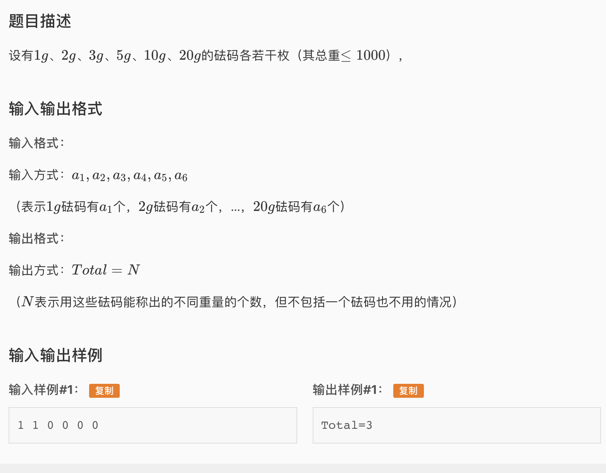

* 题目如下

* 这道题想到了用一个bool数组存能否称到某个重量，但是用布尔操作太麻烦，用bitset特别简单，这里记录一下bitset的一些特点
  * bitset可以直接print出来，是二进制的形式
  * bitset的[0]是表示最右边的数字，所以位移的时候要注意一下
  * bitset.count()可以直接输出有多少个1
  * bitset如果位移要**改值**需要b \>\>= 2而不是b \>\> 2

* AC 代码

```c
#include <iostream>
#include <bitset>
#include <stdio.h>

using namespace std;

bitset<1010> res;//size1010的bitset
int w[6] = {1,2,3,5,10,20};
int arr[10];

int main(){
	for(int i = 0; i < 6; i++){
		int a; cin >> a;
		arr[i] = a;
	}
	res[0] = 1;
	for(int i = 0; i < 6; i++){
		for(int j = 0; j < arr[i]; j++){
			res |= res << w[i];
		}
	}
	cout << "Total=" << res.count() - 1;
	return 0;	
}
```

