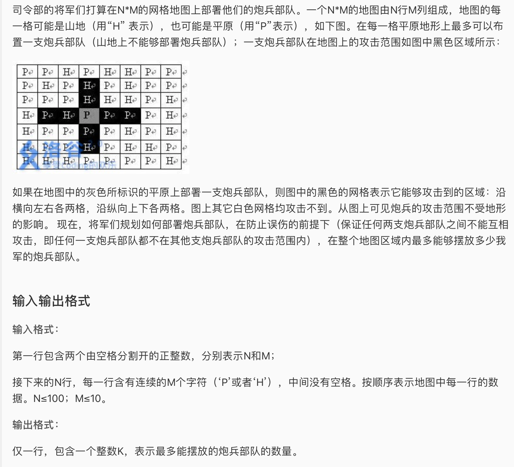

* 这是一道状压dp，提高+/省选 蓝题难度。看了题解还花了3个小时。我的愚笨的思路如下
  * 由于炮兵上下会影响两格，所以用一个四维dp f[i][j][k][d]记录最后一行为第i行，状态为j，倒数第二行状态为k，倒数第三行状态为d的时候的最大值。
  * 上来就犯了个错误，我觉得由于每个炮兵之间最少隔两格，就算有四个空格也最多放两个炮兵，所以理论上讲每一行可行的states状态不会超过2的（10/2）次方，也就是32.但是实际上那只是第一格放炮兵的情况，第一格并不一定要放炮兵，实际的states可能性要大得多。所以我的四维数组会爆。
  * 结果就是TLE and WA了，至于为什么WA, 我并不是很清楚，但是TLE肯定是我的dp方式遍历太多东西了。
* 看了题解，总结了以下几点：
  * 以后的状压dp如果是给一个010101的矩阵数据，把每一行压缩成一维数组去储存。不用放在列表中。
  * 并不一定需要把每个state都初始化算出来，2的行中格子数次方就是所有可能的状态，可以从0遍历到这个数，然后动态的用位运算判断是否符合条件。
  * 位运算有时候不是很好阅读，内在的逻辑错一点满盘皆错，我就因为有一个地方是取反没注意到debug了一个多小时。
  * 就算多个for循环嵌套，在一个for循环之前可以加这一层的特判，而不是在最里面的for循环中塞入所有判断条件，这样只要外层不行就直接continue了，可以省很多runtime。
  * 事实证明，register int没什么卵用，完全看不到速度提升， 反而好像还慢了。
* AC 代码

```c
#include <iostream>
#include <cstdio>
#include <cstring>
#include <algorithm>

using namespace std;
int n,m, a[105], sum[(1<<10)],f[3][(1<<10)][(1<<10)];
char t[15];

int count_one(int i){
	int cnt = 0;
	while(i){
		if(i&1) cnt++;
		i >>= 1;
	}
	return cnt;
}

void init(){
	scanf("%d%d", &n, &m);
	for(int i = 0; i < n; i++){
		scanf("%s", &t);
		for(int j = 0; j < m; j++){
			a[i] <<= 1;
			a[i] += (t[j] == 'H' ? 1 : 0);
		}
	}
}


int main(){
	init();
	for(int i = 0; i < (1<<m); ++i){
		sum[i] = count_one(i);
	}
	//初始化前两行
	for(register int i = 0; i < (1<<m); ++i){
		for(register int j = 0; j < (1<<m); ++j){
			if(!( (i&j) || (i&(i<<1)) || (i&(i<<2)) || (j&(j<<1)) || (j&(j<<2)) || (i&a[0]) || (j&a[1])))
			f[1][i][j] = sum[i] + sum[j];
		}
	}
	for(register int i = 2; i < n; i++){
		for(register int j = 0; j <(1<<m);++j){
			if( (j&(j<<1)) || (j&(j<<2)) || (j&a[i-1])) continue;
			for(register int k = 0; k <(1<<m); ++k){
				if( (k&(k<<1)) || (k&(k<<2)) || k&a[i] || k&j) continue;
				for(register int c = 0; c <(1<<m); ++c){
					if( c&j || k&c || (c&(c<<1)) || (c&(c<<2)) || (c&a[i-2])) continue;
					f[i%3][j][k] = max(f[(i-1)%3][c][j] + sum[k], f[i%3][j][k]);
				}
			}
		}
	}
	int best = -1;
	for(register int i = 0; i < (1<<m); ++i){
		for(register int j = 0; j < (1<<m); ++j){
			best = max(best, f[(n-1)%3][i][j]);
		}
	}

	cout << best;


	return 0;
}
```