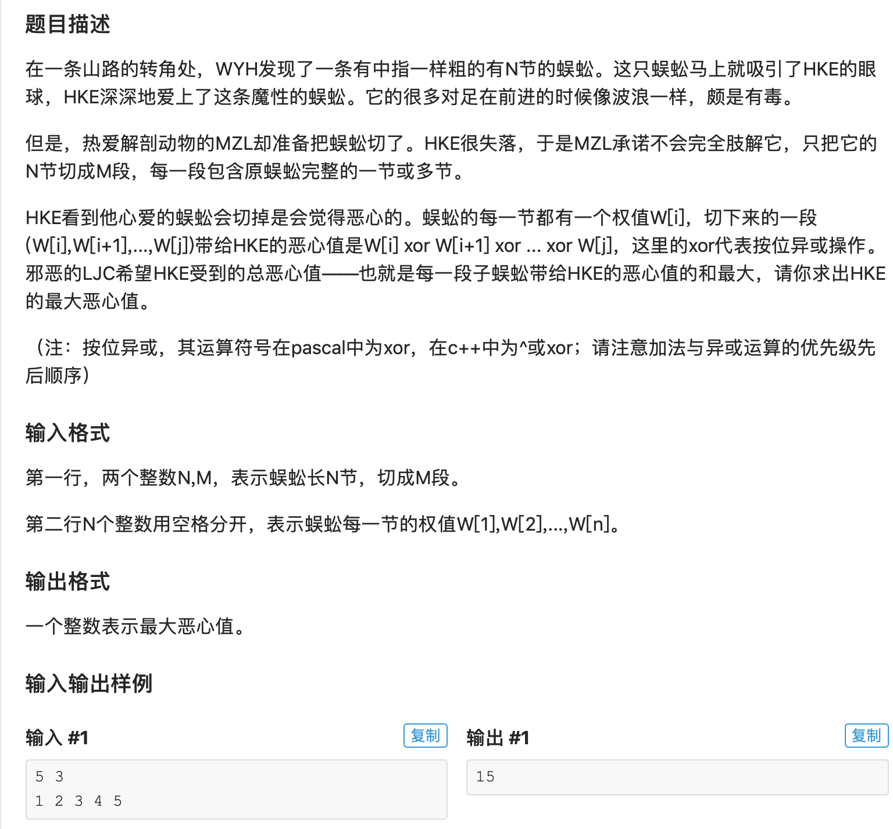

* 这是一道区间dp的题，这一点我想到了，但是如果三维dp貌似空间复杂度太高。这道题和石子合并的不同点就在于石子合并没有连续性，而切段有连续性，后一段一定在前一段的后面。所以这道题可以从前往后考虑，而不用考虑每一个可能的区间。
* 再一个需要注意的点就是这个Xor。我们用sum[i]数组储存w[1]^w[2]^…^w[i]的值，相当于一个前缀异或。这个好处就是如果我们想要求从 i 到 j 这一段w的Xor, 只需要求sum[i] ^ sum[j]即可，因为a^a = 0\. 重叠部分可以消掉。

* AC 代码，注意范围，j的起点导致3个点卡了很久

```c
#include <iostream>
#include <algorithm>
#include <vector>
#include <cstdio>
#include <climits>
#include <cstring>
#define maxn 1005
#define maxm 105

using namespace std;
int n,m, w[maxn];
//Dynamic Programming Array
int f[maxn][maxm];

int sum[maxn];

void init(){
	memset(f,-1, sizeof(f));
	scanf("%d%d", &n, &m);
	for(int i = 1; i <= n; i++){
		scanf("%d", w+i);
	}
	//compute Xor in sum
	sum[1] = w[1];
	for(int i = 2; i <= n; i++){
		sum[i] = sum[i-1]^w[i];
	}
	for(int i = 1; i <= n; i++){
		f[i][1] = sum[i];
	}
}

void dp(){
	for(int i = 2; i <= m; i++){
		// 这里j的起始点是j，因为这个wa了很久
		for(int j = 2; j <= n; j++){
			for(int k = 1; k < j; k++){
				f[j][i] = max(f[j][i], f[k][i-1] + (sum[j]^sum[k]));
			}
		}
	}
}

int main(){
	init();
	dp();
	cout << f[n][m] << endl;
	return 0;}

```