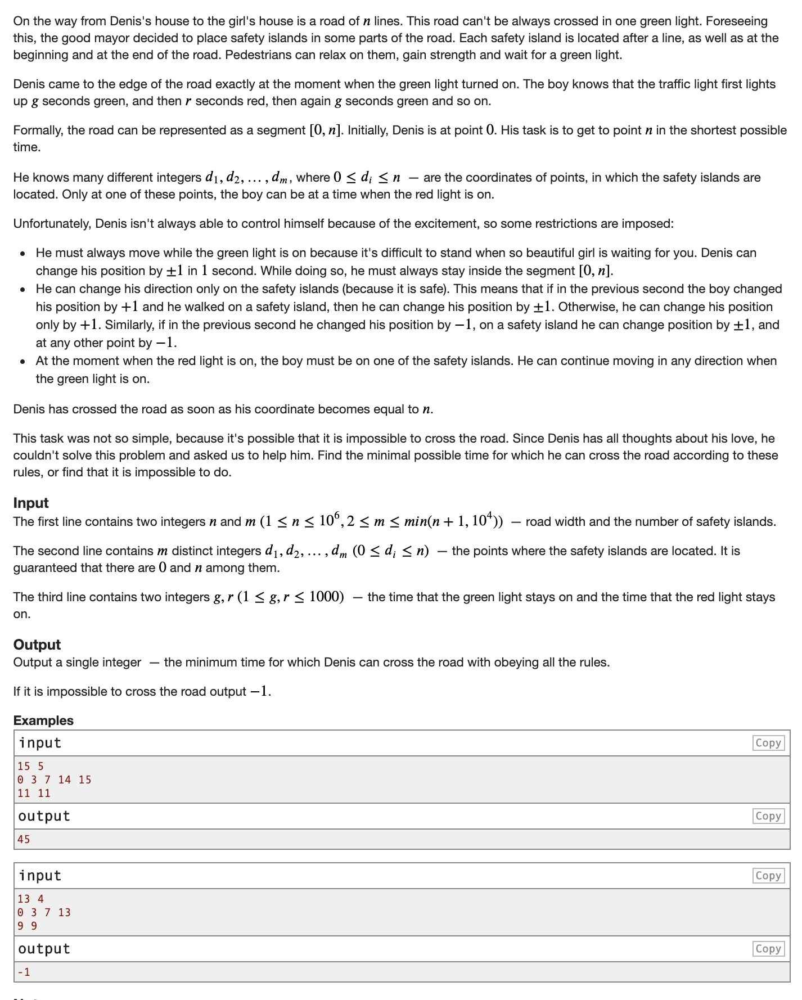

* 首先发现这道题的结构有一个特点，就是走的方式是periodic，每个周期是一个红绿灯，如果我们在一个绿灯时段的同一个时间到达了同一个安全岛，之后的所有可能应该是完全相同的，说明我们在做无用功。所以自然想到mod。对于每个安全岛，我们可以给它分g个状态（g为绿灯时段时长），表示我们到达这个安全岛的时候，绿灯时段过了多久。比如 第一个安全岛的第1个状态，就代表我们在绿灯时段走到这个安全岛的时候，绿灯时段过了一个单位时间。
* 整个状态图是一个0-1 undirected graph，什么叫0-1图呢？其实就是一个无向图，边权只有0或1\. 为什么这道题的状态图是一个0-1图呢？假设我们现在在第i个安全岛，那么我们可以选择 往前走到达第i + 1个安全岛 或者 往后走走回第i-1个安全岛（当然往岛i+1走的前提是岛i到岛i+1 distance小于等于绿灯时段长度g，往i-1岛走的前提也一样）。如果distance \< g，那这条边的边权记为0，如果distance = g，记为1，这样表示的意思是：走了这条边，最后总时长就多了一个红绿灯period。因为我们记的distance其实是过了几个红绿灯period。当最后到达终点的时候，（r+g）\*dist 加上最后一段绿灯，就可以得到总时长。所以我们只需要在这个01图上找到最短路即可

* 0-1图是weighted graph，找最短路难道只能大费周章用dijkstra/spfa嘛？并不是，其实由于0-1图的特殊性质，我们只需要在bfs上做一点点改动就可以找最段路了。
* 01 bfs
  * 和传统bfs的唯一区别就是用deque维护而不是queue，首先当deque不为空，从deque中pop\_front(和bfs从queue里popfront一样)，得到一个节点。然后我们枚举这个点的所有边，当发现可以松弛距离（缩短dist[i]）的节点t的时候，如果的当前枚举的边边权为1，那么把这个被松弛的点pushback，如果是0，pushfront。deque两头都能进的特点完美对应了01图的binary nature。这样操作最后达到的效果就是优先枚举距离短的点，deque中的节点距离是从小到大排列的，效果和dijkstra的heap一样，但是实现起来非常简单。
* 01 bfs code （geeksforgeeks.org）

```c
// Prints shortest distance from given source to 
// every other vertex 
void zeroOneBFS(int src) 
{ 
    // Initialize distances from given source 
    int dist[V]; 
    for (int i=0; i<V; i++) 
        dist[i] = INT_MAX; 
  
    // double ende queue to do BFS. 
    deque <int> Q; 
    dist[src] = 0; 
    Q.push_back(src); 
  
    while (!Q.empty()) 
    { 
        int v = Q.front(); 
        Q.pop_front(); 
  
        for (int i=0; i<edges[v].size(); i++) 
        { 
            // checking for the optimal distance 
            if (dist[edges[v][i].to] > dist[v] + edges[v][i].weight) 
            { 
                dist[edges[v][i].to] = dist[v] + edges[v][i].weight; 
  
                // Put 0 weight edges to front and 1 weight 
                // edges to back so that vertices are processed 
                // in increasing order of weights. 
                if (edges[v][i].weight == 0) 
                    Q.push_front(edges[v][i].to); 
                else
                    Q.push_back(edges[v][i].to); 
            } 
        } 
    } 
  
    // printing the shortest distances 
    for (int i=0; i<V; i++) 
        cout << dist[i] << " "; 
} 
```

* cf solution

```c
#include<bits/stdc++.h>
using namespace std;
 
using ll = long long int;
 
vector<vector<int>> dist;
vector<vector<bool>> was;
 
int main() {
    int n, m;
    cin >> n >> m;
    vector<int> arr(m + 2);
    for (int i = 0; i < m; ++i)
        cin >> arr[i + 1];
    m += 2;
    arr.back() = n;
    sort(arr.begin(), arr.end());
    ll G, R;
    cin >> G >> R;
    dist.resize(m, vector<int>(G+1));
    was.resize(m, vector<bool>(G+1));
    deque<pair<int, int>> bfs;
    bfs.push_back({0, 0});
    was[0][0] = 1;
    ll ans = -1;
    while (bfs.size()) {
        int v = bfs.front().first;
        int t = bfs.front().second;
        bfs.pop_front();
        if (t == 0) {
            int tTo = n - arr[v];
            if (tTo <= G) {
                ll tempAns = (R + G) * dist[v][t] + tTo;
                if (ans == -1 || ans > tempAns)
                    ans = tempAns;
            }
        }
        if (t == G) {
            if (was[v][0] == 0) {
                dist[v][0] = dist[v][t] + 1;
                bfs.push_back({v, 0});
                was[v][0] = 1;
            }
            continue;
        }
        if (v) {
            int tTo = t + arr[v] - arr[v - 1];
            if (tTo <= G && was[v-1][tTo] == 0) {
                was[v-1][tTo] = 1;
                dist[v-1][tTo] = dist[v][t];
                bfs.push_front({v-1, tTo});
            }
        }
        if (v < m - 1) {
            int tTo = t + arr[v + 1] - arr[v];
            if (tTo <= G && was[v+1][tTo] == 0) {
                was[v+1][tTo] = 1;
                dist[v+1][tTo] = dist[v][t];
                bfs.push_front({v+1, tTo});
            }
        }
    }
    cout << ans;
}
```

* My AC code
  * 可以用vis数组，也可以set inf，两种二选一即可

```c
#include <iostream>
#include <queue>
#include <assert.h>   
#include <vector>
#include <algorithm>
#include <time.h>
#include <numeric>
#include <string>
#include <cstring>
#include <stack>
#include <unordered_set>
#include <unordered_map>
#include <set>
#include <map>
#include <numeric>
#include <iomanip>
#include <cstdlib>
#include <climits>
#include <cmath>
#include <deque>
#include <cstdio>
using namespace std;
#define ll long long
#define ld long double 
#define pi pair<int, int> 
#define pl pair<ll,ll>  
#define pd pair<ld,ld> 
#define str string  
#define mp make_pair
#define vi vector<int> 
#define vl vector<ll> 
#define vd vector<ld> 
#define vs vector<str> 
#define vpi vector<pi> 
#define vpl vector<pl> 
#define vpd vector<pd> 
#define si set<int> 
#define FF(i,j,n) for(signed i=j;i<=n;i++)  
#define DD(i,j,n) for(signed i=j;i>=n;i--) 
#define F(i,j,n) for(signed i=j;i<n;i++)   
#define D(i,j,n) for(signed i=j;i>n;i--) 
#define mem(a,b) memset(a,b,sizeof(a))
#define ndl cout << endl
#define ull unsigned long long 

const int inf = 0x3f3f3f3f;
const ll INF = 0x3f3f3f3f3f3f3f3fLL;


#define sz(x) (signed)x.size()
#define all(x) begin(x), end(x)
#define rall(x) (x).rbegin(), (x).rend() 
#define rsz resize
#define ins insert 
#define ft front() 
#define bk back() 
#define fi first
#define se second
#define pf push_front 
#define pb push_back
#define eb emplace_back 
#define lb lower_bound 
#define ub upper_bound 
#define IOS ios_base::sync_with_stdio(false);cin.tie(NULL);cout.tie(NULL);

//math
const int mod = 1e9 + 7;

ll powmod(ll a,ll b) {ll res=1;a%=mod; assert(b>=0); for(;b;b>>=1){if(b&1)res=res*a%mod;a=a*a%mod;}return res;}
ll gcd(ll a,ll b) { return b?gcd(b,a%b):a;}
int pct(int x) { return __builtin_popcount(x); } 
int bit(int x) { return 31-__builtin_clz(x); } // floor(log2(x)) 
int cdiv(int a, int b) { return a/b+!(a<0||a%b == 0); } // division of a by b rounded up, assumes b > 0 


//DEBUG, compile with -DLOCAL
void DBG() { cerr << "]" << endl; }
template<class H, class... T> void DBG(H h, T... t) {
  cerr << to_string(h); if (sizeof...(t)) cerr << ", ";
  DBG(t...); }
#ifdef LOCAL 
#define dbg(...) cerr << "[" << #__VA_ARGS__ << "]: [", DBG(__VA_ARGS__)
#define HERE cout << "===GOTHERE===" << endl
#else
#define dbg(...) 42
#define HERE 42
#endif

//#define double long double
//#define int long long
//#define int unsigned long long

const int maxn = 1e4+20;

int n,m,R,G;
//bool vis[maxn][1004];
int dis[maxn][1004];
int a[maxn];
deque<pi> dq;


void solve(){
	F(i,0,m){
		F(j,0,G){
			dis[i][j] = inf;
		}
	}
	dis[0][0] = 0;
	dq.pb({0,0});

	int ans = -1;
	while(!dq.empty()){
		int idx = dq.ft.fi;
		int mval = dq.ft.se;
		dq.pop_front();
		int curr = dis[idx][mval];
		//if it can go back


		if(mval == 0){
			int rem = n - a[idx];
			if(rem <= G){
				int tt = (R+G)*dis[idx][mval] + rem;
				if(ans == -1 || ans > tt){
					ans = tt;
				}
			}
		}

		if(idx > 0){
			int need = a[idx] - a[idx - 1];
			int have = G - mval;
			if(need == have){
				if(dis[idx-1][0] > curr + 1){
					dis[idx-1][0] = curr + 1;
					dq.pb({idx-1,0});
				}
			}else if(need < have){
				if(dis[idx-1][mval + need] > curr){
					dis[idx-1][mval + need] = curr;
					dq.pf({idx-1, mval+need});
				}
			}
		}	

		//if it can go forward
		if(idx < m - 1){
			int need = a[idx + 1] - a[idx];
			int have = G - mval;
			if(need == have){
				if(dis[idx+1][0] > curr + 1){
					dis[idx + 1][0] = curr + 1;
					dq.pb({idx+1,0});
				}
			}else if(need < have){
				if(dis[idx + 1][mval + need] > curr){
					dis[idx + 1][mval + need] = curr;
					dq.pf({idx + 1, mval + need});
				}
			}
		}
	}


	cout << ans << endl;
}

signed main(){
  //clock_t t1 = clock();  
	IOS
	//read input
	cin >> n >> m;
	F(i,0,m) cin >> a[i];
	cin >> G >> R;
	sort(a, a + m);
	solve();
  //cout << "THE ALGORITHM TOOK: " << (clock() - t1) * 1.0 / CLOCKS_PER_SEC * 1000 << "ms"<< endl;
	return 0;
}
```