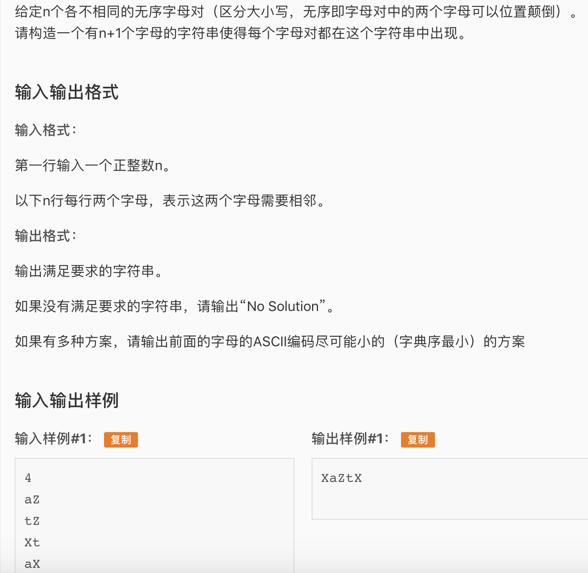

* 一道靠自己的能力过了的蓝题。考点是欧拉图，欧拉图的详细题解参照graph/luogu\_p2731。可能这道题如果没想到欧拉图会比较难，如果知道用欧拉图了套模版就行了。看到这种对，所有方案中字典序最小，就应该想到用欧拉图。这道题有一个坑点就是在ascii中大些和小写不是连续的，中间隔了一些特殊字符，所以转换的时候首先要判断一次大小写。貌似这道题还可以卡连通性，比如图中有多个欧拉图，但是不是连续的。这样也是no solution。但是这道题没卡这个点。如果卡的话可以判断一下我们找到的欧拉路的边数是否等于总边数。
* 思路就是每个字母是一个顶点，然后对是边（无序的，所以是无向边）。然后Hierholzer找欧拉路即可。Hierholzer详细解释请看 graph/luogu\_p2731