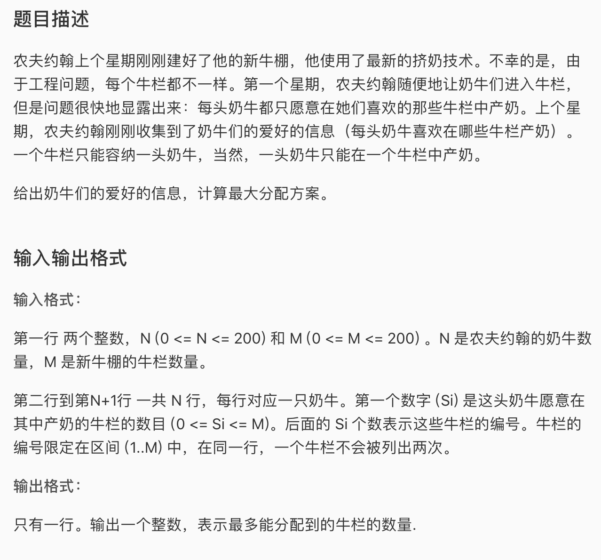

* 这是一道二分图匹配的题，可以参考模版graph/luogu\_p3386。几乎完全没变就是套模版。想明白了一个地方，就是used=1为什么要在第二个if上面。就是不管这个点能不能通过直接连接或者腾地儿匹配上，我们都标记这个点已经被考虑了。根据进不进第二个if，used[i]有两个意义，要么根本腾不出来，要么是上层节点要求腾的，你不能再连。

* AC 代码

```c
#include <iostream>
#include <cstdio>
#include <cstring>
#include <vector>
#define maxn 205

using namespace std;
int n,m, ans, ym[maxn];
bool g[maxn][maxn], used[maxn];


void init(){
	scanf("%d%d", &n, &m);
	for(int i = 1; i <= n; i++){
		int x; scanf("%d", &x);
		for(int j = 1; j <= x; j++){
			int d; scanf("%d", &d);
			g[i][d] = true;
		}
	}
}

bool hungarian(int s){
	for(int i = 1; i <= m; i++){
		if(g[s][i] && !used[i]){
			//把true设置在这里意思是这个点要腾
			used[i] = true;
			if(ym[i] == 0 || hungarian(ym[i])){
				ym[i] = s;
				return true;
			}
		}
	}
	return false;
}

int main(){
	init();
	for(int i = 1; i <= n; i++){
		memset(used, 0, sizeof(used));
		if(hungarian(i)) ans++; 
	}
	cout << ans;
	return 0;
}
```