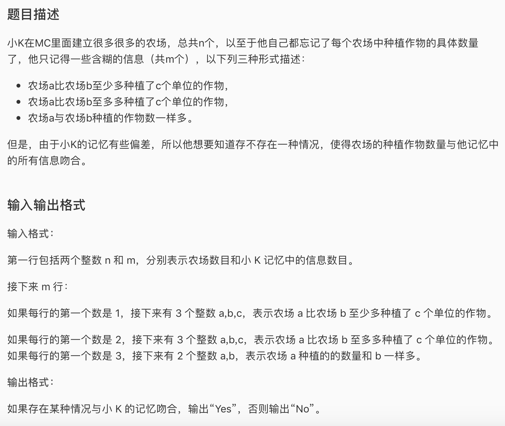

* 这是一道差分约束的蓝题。差分约束就是给出很多 x1 \<= x2 + c的形式的条件，问你有没有满足所有条件的一组解。注意题目中可以有很多变式，但是最后要统一转化成x1 \<= x2 + c的形式，c可以是负数。然后我们可以用几何的角度去思考可以从x2这个节点往x1节点连一条weight为c的边。对于每个条件都这么做，最后从原点0往每个点连一条长度为0的边，跑spfa，判断负环，如果有，无解，如果没有，有解。有负环在这里就代表两个条件是矛盾的，比如a\>b b\<a这样。然后spfa求出的最短路就是最小的解。
* AC 代码，注意这里SPFA判负环的标准不一定是最优的，但是由于负环一定会让spfa陷入死循环，所以只要设置一个标准即可。还有一种dfs+spfa判负环的方法，就是跑n遍spfa，分别从每个节点跑。然后跑的时候点亮跑过的节点，如果能松弛继续dfs，如果发现一个节点已经被点亮过，说明能松弛且回来了，这就说明有负环，就直接输出no。

```c
#include <iostream>
#include <cstdio>
#include <vector>
#include <algorithm>
#include <queue>
#include <cstring>
#define maxn 10005

using namespace std;

struct Edge{
	int to, w;
};
int n,m, dis[maxn], ecnt;
vector<Edge> adj[maxn];
bool inq[maxn];
queue<int> q;


void add_edge(int f, int t , int wt){
	adj[f].push_back((Edge){t,wt});
	ecnt++;
}	

void init(){
	scanf("%d%d", &n, &m);
	for(int i = 1; i <= m; i++){
		int x,a,b,c; scanf("%d%d%d",&x, &a, &b);
		if(x==1){
			scanf("%d", &c);
			add_edge(b,a,-c);
		}else if(x==2){
			scanf("%d", &c);
			add_edge(b,a,c);
		}else{
			add_edge(a,b,0);
			add_edge(b,a,0);
		}
	}
	for(int i = 1; i <= n ;i++){
		add_edge(0,i,0);
	}
}

bool spfa(){
	memset(dis, 127, sizeof(dis));
	q.push(0); inq[0] = true; dis[0] = 0;int cnt = 0;
	while(!q.empty()){
		int t = q.front(); q.pop();
		inq[t] = false;
		for(int i = 0; i < adj[t].size(); ++i){
			int tp = adj[t][i].to;
			if(dis[tp] > dis[t] + adj[t][i].w){
				dis[tp] = dis[t] + adj[t][i].w;
				if(!inq[tp]){
					inq[tp] = true;
					q.push(tp);
					cnt++;
					if(cnt > ecnt){
						return false;
					}
				}
			}
		}
	}
	return true;
}

int main(){
	init();
	bool res = spfa();
	if(res){
		cout << "Yes";
		return 0;
	}
	cout << "No";
	return 0;
}
```

* dfs+spfa （来自luogu用户a526955194）

```c
#include <cstdio>
#include <vector>
#include <cstring>
using namespace std;
struct A{
    int to,cost;
};
vector <A> a[10005];
int dis[10005],x,y,z,i,j,n,m,t;
bool flag,f[10005];
void spfa(int x){
    f[x]=true;
    for (int i=0;i<a[x].size();i++){
        A e=a[x][i];
        if (dis[e.to]>dis[x]+e.cost){
            if (f[e.to]){
                flag=true;
                return;
            }
            dis[e.to]=dis[x]+e.cost;
            spfa(e.to);
        }
    }
    f[x]=false;
    return;
}
int main(){
    scanf("%d%d",&n,&m);
    for (i=1;i<=m;i++){
        scanf("%d%d%d",&x,&y,&z);
        if (x==1) scanf("%d",&t),a[y].push_back((A){z,-1*t});
        if (x==2) scanf("%d",&t),a[z].push_back((A){y,t});
        if (x==3) a[y].push_back((A){z,0}),a[z].push_back((A){y,0});
    }
    flag=false;
    for (i=1;i<=n;i++){
        dis[i]=0;
        spfa(i);
        if (flag) break;
    }
    if (flag) printf("No");
    else printf("Yes");
    return 0;
}
```