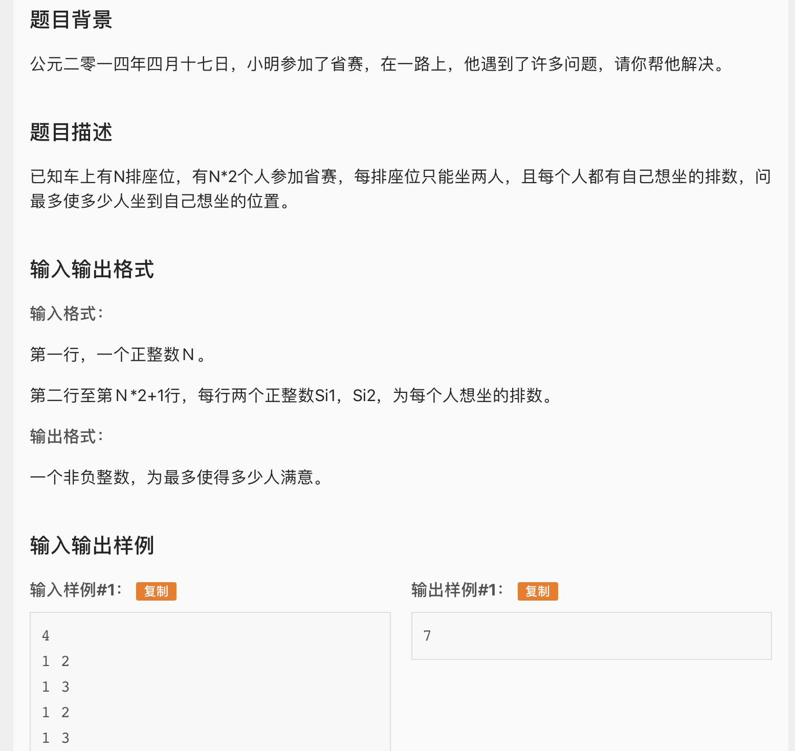

* 应该是继那道状压dp之后第二道自己一遍过的蓝题，这是一道二分图匹配，匈牙利可以过。匈牙利算法详解见graph/luogu\_p3386。但是这道题需要稍微在模版的基础上变通一下，因为每个座位可以坐两个人，所有右侧节点一个座位应该对应两个节点。然后左侧一个人应该链接四个节点，因为一个人可以坐四个座位。
* 这道题费时间弄懂了一个点，就是如果用邻接表而不是邻接矩阵存图一定要保证编号小的节点在前，大的在后。因为匈牙利协商的时候是从小到大扫边，如果边不是按从小到大存的，协商的过程中中间就可能留空，就不能得到最大匹配。
* AC 代码

```c
#include <iostream>
#include <vector>
#include <cstring>
#include <cstdio>
#include <algorithm>
#include <cstdlib>
#define maxn 4005

using namespace std;
int a[maxn][4], ans;
int ym[maxn];
int n, rn;
bool used[maxn];
vector<int> tmp;

void init(){
	memset(ym, 0, sizeof(ym));
	scanf("%d", &rn);
	n = 2 * rn;;
	for(int i = 1; i <= n; i++){
		tmp.clear();
		int x,y; scanf("%d%d", &x, &y);
		tmp.push_back(x); tmp.push_back(y);
		tmp.push_back(x+rn); tmp.push_back(y+rn);
		sort(tmp.begin(), tmp.end());
		//一排能坐两个人，所以一个人选两排总共有四个位置可以坐
		a[i][0] = tmp[0]; a[i][1] = tmp[1];
		a[i][2] = tmp[2]; a[i][3] = tmp[3];
	}
}

bool hungarian(int s){
	for(int i = 0; i < 4; i++){
		int t = a[s][i];
		if(!used[t]){
			used[t] = true;
			if(!ym[t] || hungarian(ym[t])){
				ym[t] = s;
				return true;
			}
		}
	}
	return false;
}

int main(){
	init();
	for(int i = 1; i <= n; i++){
		memset(used, 0, sizeof(used));
		if(hungarian(i)) ans++;
	}
	
	cout << ans;
	return 0;
}
```