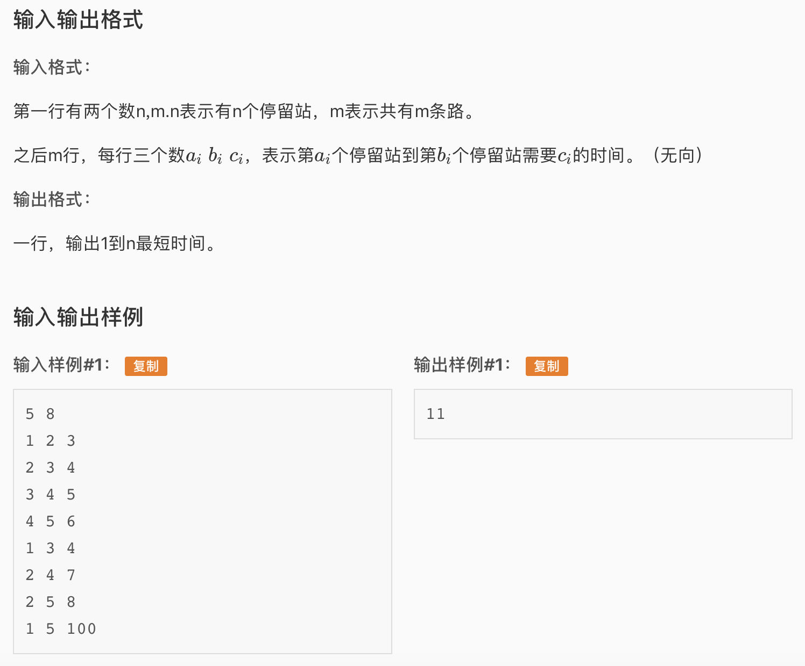

* 这道题是一个无向最短路，用SPFA模版就能过，犯了两个错误导致两次提交不过
  * 首先，是个无向图，做成了有向图
  * 第二，SPFA算法每次在pop队首元素的时候需要把inq数组设为false，如果没有这一步答案是错的

* AC 代码

```c
#include <iostream>
#include <stdio.h>
#include <cstring>
#include <string>
#include <queue>
#include <set>
#include <vector>
#define maxn 2505

using namespace std;

struct Edge{
	int to, w;
};

int n,m, pred[maxn], pren[maxn], dis[maxn];
bool inq[maxn];

vector<Edge> adj[maxn];

int main(){
	//readin data
	scanf("%d%d", &n, &m);
	for(int i = 1; i <= m; i++){
		int x,y,z;
		scanf("%d%d%d", &x, &y, &z);
		Edge e; e.to = y; e.w = z;
		adj[x].push_back(e);
		Edge e2; e2.to = x; e2.w = z;
		adj[y].push_back(e2);
	}

	//start SPFA
	memset(dis, 127, sizeof(dis));
	queue<int> q;
	q.push(1); dis[1] = 0; inq[1] = true;
	while(!q.empty()){
		int t = q.front(); q.pop();
		inq[t] = false;
		for(unsigned int i = 0; i < adj[t].size(); ++i){
			Edge te = adj[t][i]; //take an edge
			if(dis[te.to] > dis[t] + te.w){
				// if we can shorten the distance
				dis[te.to] = dis[t] + te.w;
				pren[te.to] = t; pred[te.to] = te.w;
 				if(!inq[te.to]){q.push(te.to); inq[te.to] = true;}
			}
		}
	}

	int sum = 0; 
	int now = n;
	while(now != 1){
		sum += pred[now];
		now = pren[now];
	}

	cout << sum;

	return 0;
}
```