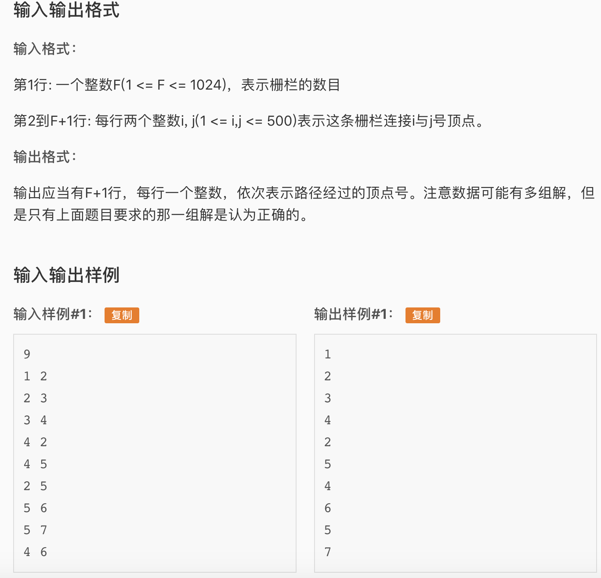

John是一个与其他农民一样懒的人。他讨厌骑马，因此从来不两次经过一个栅栏。你必须编一个程序，读入栅栏网络的描述，并计算出一条修栅栏的路径，使每个栅栏都恰好被经过一次。John能从任何一个顶点(即两个栅栏的交点)开始骑马，在任意一个顶点结束。

每一个栅栏连接两个顶点，顶点用1到500标号(虽然有的农场并没有500个顶点)。一个顶点上可连接任意多(\>=1)个栅栏。两顶点间可能有多个栅栏。所有栅栏都是连通的(也就是你可以从任意一个栅栏到达另外的所有栅栏)。

你的程序必须输出骑马的路径(用路上依次经过的顶点号码表示)。我们如果把输出的路径看成是一个500进制的数，那么当存在多组解的情况下，输出500进制表示法中最小的一个 (也就是输出第一位较小的，如果还有多组解，输出第二位较小的，等等)。

输入数据保证至少有一个解。



* 这是一道欧拉路的题，我们先捋一捋定义
  * 基本定义
    * 欧拉图：有欧拉路或者欧拉回路的图
    * 欧拉路：能遍历所有顶点，且把所有边都经过一次（必须仅一次）的路。注意顶点可以经过多次
    * 欧拉回路：可以看作欧拉路的一个子集，能遍历所有顶点，且把所有边都经过一次（必须仅一次）的回路（必须遍历完之后回到起始点）。
  * 判断欧拉路/欧拉回路的存在性
    * 要做到这一点非常简单，如果所有定点的度数(degree)都是偶数，那么存在欧拉回路。如果所有定点的度数中有且仅有两个顶点的度数是奇数，其它的顶点度数都是偶数，那么存在欧拉路，且这两个奇数度数的顶点一个是起始点一个是终止点。
* 要找一个欧拉图中的一条欧拉回路有两个常用的算法
  * Hierholzer， CSCI170中介绍的算法，就是从起始点开始dfs，如果不能走了就退回到之前的点。如果前面的点有边可以走，就从那里走一个回路，以此类推
  * Fleury，选择边走的过程可以看作从原图中一条一条拆边，优先选择不会把图disconnect的边。
  * 注意！！这两个算法运行的前提条件都是用上述方法判断一个图中有 欧拉路/欧拉回路。如果没判断的话算法可能出现错误
* 竞赛中基本大家用的都是hierholzer, 而且这个算法的效率比fleury更高，所以这里就介绍hierholzer。

* Hierholzer
  * 首先，我们必须要判断这个图是否是欧拉图。所以用一个deg数组存每个顶点的degree。这道题中顶点数很少，所以用邻接矩阵存图。读取完数据之后便利一遍degree。注意这道题的题目描述中已经保证本题每个test case一定是欧拉图，所以我们只需要判断我们要找的是欧拉路还是欧拉回路即可。如果便利一遍没有找到odd degree vertex，那么一定是欧拉回路，只要找到一个odd degree vertex，那么我们知道一定是欧拉路而不是欧拉回路，这时候从这个顶点开始跑Hierholzer就可以了
  * 核心算法：
    * 很多题解中都会把Hierholzer的那个函数叫做bfs，我觉得这其实有点误导。Hierholzer对stack的运用和dfs正好是相反的。dfs是遍历的过程中遇到一个node，入栈，在某个点A没有点可以去了，A出栈。Hierholzer是如果点A没有点可以去了，入栈。我的猜想是Hierholzer如果运用到有topological order的有向图上得到的路径就是一个viable的topological order。可以看作Hierholzer是吧dfs pop出来的node用另一个stack接住（还记得两个stack可以组成一个queue这个概念吗？）。
* AC 代码

```c
#include <cstdio>
#include <iostream>
#include <cstring>
#include <stack>
#include <algorithm>
#define maxn 505

using namespace std;

int n;
int g[maxn][maxn];
int deg[maxn], start, mx;
stack<int> s;

void init(){
	//Read input
	scanf("%d", &n);
	for(int i = 1; i <= n; i++){
		int x,y; scanf("%d%d",&x, &y);
		mx = max(mx,max(x,y));
		g[x][y]++;
		g[y][x]++;
		deg[x]++; deg[y]++;
	}
	start = 1;
}

void find_start(){
	//Find starting point for hierholzer.
	//If there is no odd degree vertex, start from 1
	//If there are 2 odd degree vertex(guaranteed by the problem), start
	//from the smaller one.
	for(int i = 1; i <= mx; i++){
		if(deg[i]&1){ //Same as deg[i]%2, but faster.
			//If this node has odd degree
			start = i;
			break;
		}
	}
}

void hierholzer(int fr){
	//Hierholzer's algrithm for finding A euler path.
	for(int j = 1; j <= mx; j++){
		if(g[fr][j]){
			g[fr][j]--; g[j][fr]--;
			hierholzer(j);
		}
	}
	s.push(fr);
}

void prt(){
	//Print answer
	while(!s.empty()){
		cout << s.top() << endl;
		s.pop();
	}
}

int main(){
	init();
	find_start();
	hierholzer(start);
	prt();
	return 0;
}
```


