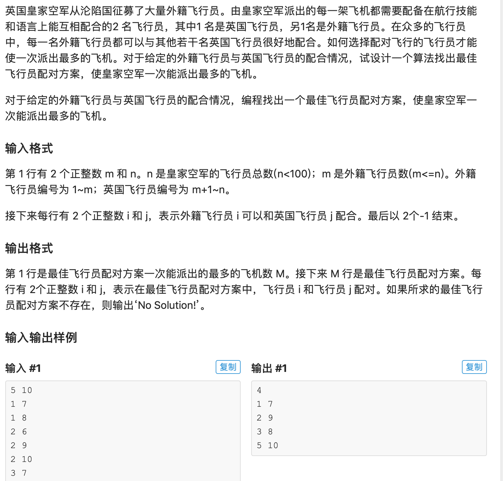

* 一道二分图匹配的蓝题，匈牙利能过。匈牙利算法见graph/luogu\_p3386。这道题就是输入比较奇怪，然后节点n是个总数，注意一下就好。

* AC 代码

```python
#include <iostream>
#include <cstdio>
#include <cstring>
#include <vector>
#include <algorithm>
#define maxn 105

using namespace std;
int n,m,ym[maxn], used[maxn], cnt;
bool g[maxn][maxn];

void init(){
	//Read graph
	scanf("%d%d", &m, &n);
	int x = 0; int y = 0;
	while(1){
		scanf("%d%d", &x, &y);
		if(x == -1 || y == -1) break;
		g[y][x] = true;
	}
}

bool hungarian(int s){
	for(int i = 1; i <= m; i++){
		if(g[s][i] && !used[i]){
			used[i] = true;
			if(ym[i] == 0 || hungarian(ym[i])){
				ym[i] = s;
				return true;
			}
		}
	}
	return false;
}

int main(){
	init();
	for(int i = m+1; i <= n; i++){
		memset(used, 0, sizeof(used));
		if(hungarian(i)) cnt++;
	}

	//print answer 
	printf("%d\n",cnt);
	for(int i = 1; i <= m; i++){
		if(ym[i]) printf("%d %d\n", i, ym[i]);
	}

	return 0;
}
```