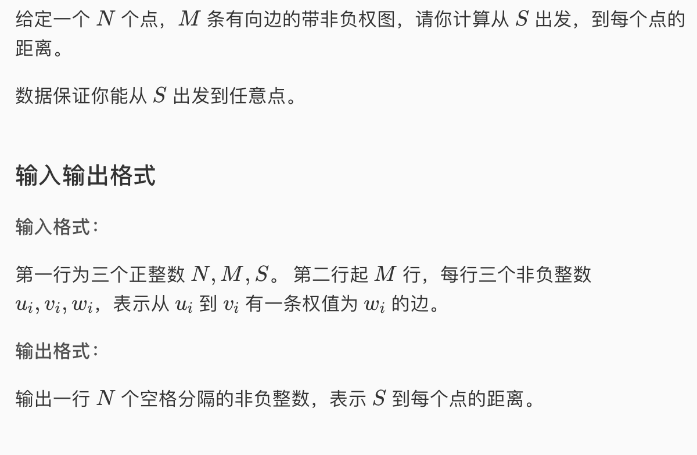
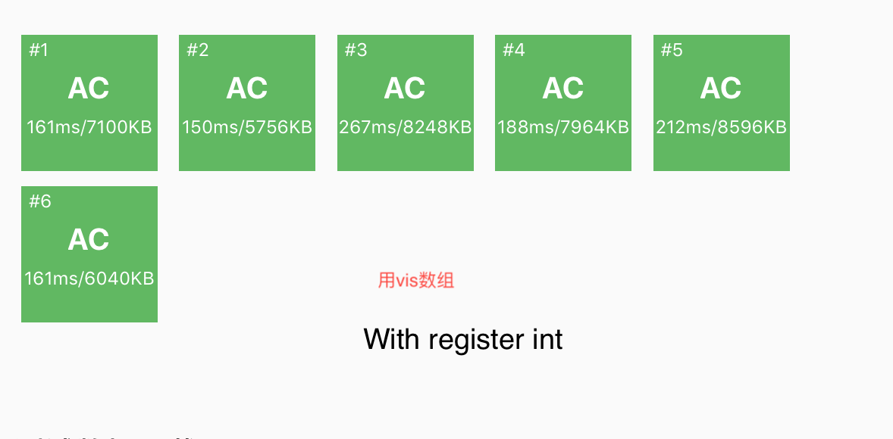
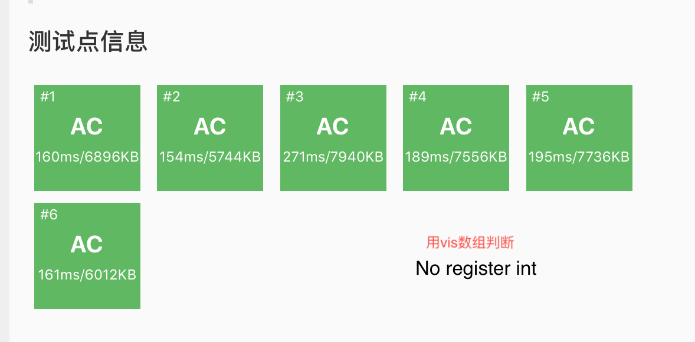
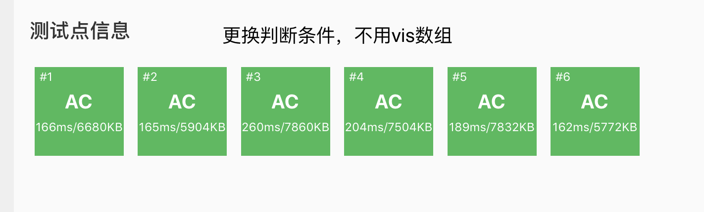

* 

* 前面我们有提到过竞赛中如果遇到有最短路的题用SPFA写起来很简单。但是SPFA的复杂度是O(NM）对于密集图来说可能复杂度会爆掉，这道题的数据就是专门绊SPFA的。Dijkstra虽然写起来稍微复杂一些，但是复杂度可以达到O((N+M)logN)。这道题用Djkstra可以过，可以当作Dijkstra的模版题。

* Dijkstra和SPFA的思路比较
  * SPFA是只要松弛成功，不在队列中就入队，到一个节点的通路如果没有一次找到最短的可能这个节点会在找到最短路之前入队出队很多次，这种特点也是SPFA能处理负权图的原因: 只要一个点能松弛，就代表它连接到的点也有可能松弛，所以我们需要把它放入队列中，用于以后松弛它之后的点。SPFA结束的过程就是如果所有点都没法松弛了，也就没有点入队了，队列最终会耗尽，算法结束。
  * 但是Dijkstra中每个节点只会松弛一次，同样也是用一个队列（优化为优先队列）来存储所有点。我们在学校中学的dijkstr一般是这种思路
    * 所有的点除了起点之外，距离都设置为无穷，起点距离为0，然后全部压入优先队列中，之后从队列中一个一个pop，每次得到的都是当前能到达的距离最小的点，遍历pop出来的节点的边，然后看看能否松弛，如果能松弛的话用Decrease Key来改变队列中节点的距离值。整个过程只有一开始进行入队操作，之后只需要改队中元素的键值就可以了。
    * 思路确实可以是这样，但是实现上稍稍有点不同，因为堆的代码不是我们实现的，所以实现Decrease Key比较困难。所以索性发扬“Lazy Programming”的思想，这样维护优先队列。
      * 算法的开始不把所有节点都入队，只是把起始点入队。
      * 开始经典的while(!q.empty())循环，便利pop出来的点的所有边。只要遇见能松弛的点都压入优先队列。
      * 算法到这一步，长得还是很像SPFA的。但是区别在这里：我们在while中设置一个额外的判断条件来代替decrease key：`if(dist[curr] != tmp.dist) continue;`
        * 因为我们无差别的把能松弛的节点压入优先队列，所以一个节点可能多次存在在优先队列中，比如以下这种情况。
          * 队列中的内容(节点编号，距离)
          * （2,10） (2,15) (2,16)
        * 由于优先队列的特性和边权的非负性我们知道，就算同一个点多次出现在队列中，一定是最短的距离的那次松弛排在第一位（最小堆），因此我们pop出来的一定是距离最短的那次松弛（dijkstra有点类似于贪心，永远会选择最短的那条路，如果那条路的边数比另一条更长的路包含的边数多，那么虽然边数少的长路可能先入队，但是边数长的短边一定优先被一条一条在长路之前被pop）。而松弛之后dist数组的值就改了，上面的例子中就变成10了，和后面的几个值不相等。而我们加的判断条件如果遇到不相等直接pop然后无视。这其实等价于decrease key的作用，实现起来比较简单。叫“懒惰删除”。
      * 最后输出所有dist即可
* AC 代码

```c
#include <iostream>
#include <cstdio>
#include <algorithm>
#include <queue>
#include <vector>
#include <climits>
#include <cstring>
#define maxn 100005
#define maxm 200005

using namespace std;
struct Edge{
	int to, w;
};
struct Node{
	int pos, dist;
	bool operator< (const Node & n) const{
		return dist > n.dist;
	}
}nds[maxn];
int n,m,s;
int dist[maxn];
vector<Edge> adj[maxn];
priority_queue<Node> q;


void init(){
	memset(dist,127,sizeof(dist));
	scanf("%d%d%d",&n,&m,&s);
	for(register int i = 1; i <= m; i++){
		int x,y,z;
		scanf("%d%d%d", &x, &y, &z);
		adj[x].push_back((Edge){y,z});
	}
}

void dijkstra(){
	dist[s] = 0; q.push((Node){s,0});
	while(!q.empty()){
		Node tmp = q.top(); q.pop();
		int curr = tmp.pos; 
		if(dist[curr] != tmp.dist) continue; //懒惰删除
		for(register int i = 0; i < adj[curr].size(); ++i){
			if(dist[adj[curr][i].to] > dist[curr] + adj[curr][i].w){
			  //如果可以松弛
				dist[adj[curr][i].to] = dist[curr] + adj[curr][i].w;
				q.push((Node){adj[curr][i].to,dist[adj[curr][i].to]});
			}
		}
	}
}

int main(){
	init();
	dijkstra();
	for(register int i = 1; i <= n; i++){
		cout << dist[i] << " ";
	}
	return 0;
}
```

* 代码讲解：
  * 这里学到一个struct的骚操作，即可以不写构造函数也不用一个一个赋值，可以用一个数组进行复制之后强制类型转换成struct的类型就完成了对象的创建。比如下面push edge节点的操作。
    * `adj[x].push_back((Edge){y,z});`
  * 注意这里有两个struct，edge和node，edge的作用是存边，而node的作用只是在堆中保存节点编号，让我们知道目前距离最小的点是几号。注意这里要overload小于号，syntax不能搞错。
  * 建边的时候一定看清有向图还是无向图，这里错了一次。
  * 测试了一下，register int在这里区别不大，几乎快不了多少，据说多层嵌套循环比如floyd能快不少。
  * 上面详细解释的代替decrease key判断条件其实可以设置一个visit数组，能稍微快一点点，但是也不是决定性的影响
  * 在题解中学到了一个inline，这个关键字大致是这样的
    * 如果我们把某一段代码提出来封装一个函数，编译器在调的时候需要单独去找这段函数，如果我们这段函数很复杂还好，调用的时间相对于执行的时间几乎可以忽略。但是如果这段代码很少，比如5行以内的一个小功能，但是需要调用几万次。比如前面sequence alignment动态规划题中计算两个字符distance的函数。这时候就可以前面加一个关键字inline。作用相当于让编译器把这段代码直接替代调用处的函数名（inline这个名字就是这个意思，见名知意）。类似于define宏定义，这时候调用就不用抄写了，可以提升程序的执行速度。但是注意inline函数最好写在最前面。如果函数很长，且调用次数不多，最好不要用，也没必要用inline。

```c
inline void dis(char a, char b){return a-b;}
```





* 注意，Dijkstra无法处理负边权！！！！！