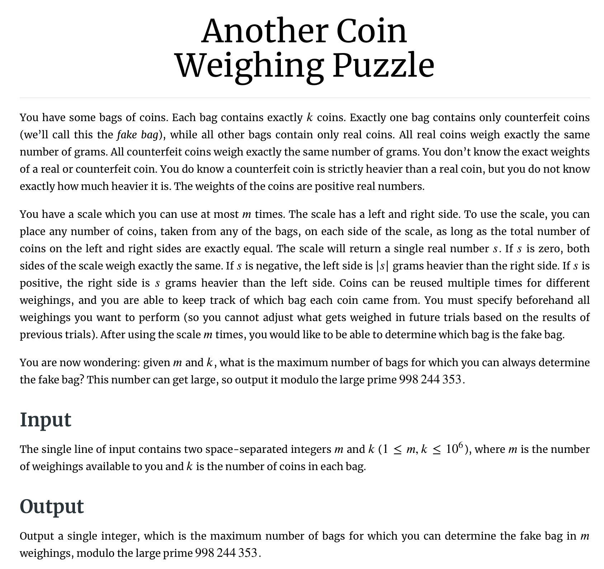
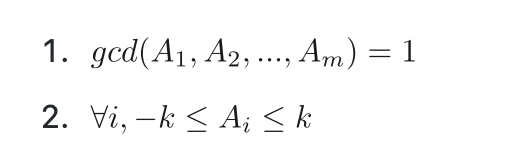
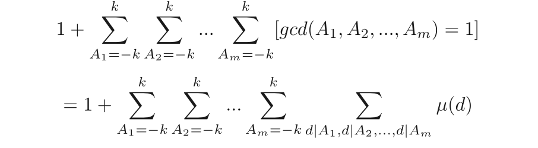
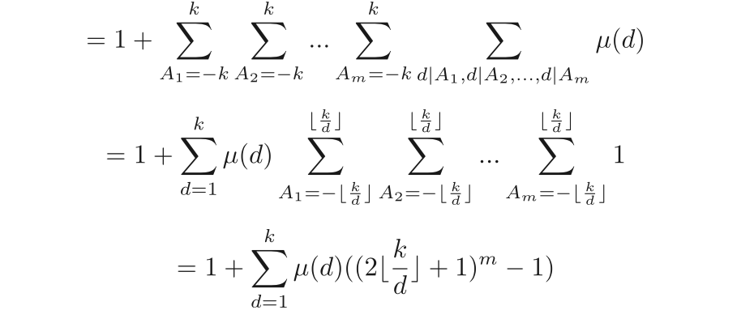
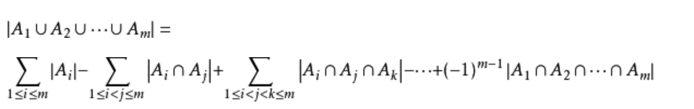
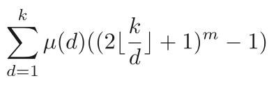

* 题目是2020 North America Championship Problem A <https://open.kattis.com/problems/anothercoinweighingpuzzle>
* 本文参考了朱昶宇题解 <https://github.com/KCFindstr/icpc-nac-2020-solutions>
  * （如果熟悉莫比乌斯反演而且一眼就能看到题目的本质建议直接看朱昶宇题解，否则建议先看完以下内容）

* 

* 这道题有两个难点
  * 1\. 把题目进行转化。
  * 2\. 利用莫比乌斯反演求解。
* 对题目进行转化
  * 这道题叫ANOTHER coin weighing puzzle，没错，称硬币的题有很多变种，而且都有某些共性，我们先来看一个最简单的版本的，来找一点灵感。
    * 现在给你10包硬币，每包有10个，知道其中有一包全是假币，假币比真币每枚沉0.1g，现在有一个精确到0.1g的称，问你如何只称一次就知道哪一包是假币？
    * 这种题怎么思考呢？如果我们只能称一次，那么必定需要somehow给每堆硬币assign一个distinct的信息，且这些信息不能混杂在一起，这样我们只称一次，从称的示数读到这个信息，看看这个信息属于哪一包，就知道哪一包是假币。因此这道题的答案就是，从第一摞拿1枚，第二摞拿两枚，第三摞拿3枚…第10摞拿10枚，最后一起称，看重量的十分位，如果是0.1那么第一摞是假币，0.2，第二摞是假币 。。。
    * 这个题的关键思想是，对于每一堆硬币，***我们通过拿的硬币的个数给这每堆硬币encode了一个distinct message***。让这个message从称重的结果中自然浮现出来得到答案，这个思想很重要！！
  * 那么再回来看这道题，我们知道能称m次，每包硬币有k个，问最多能在多少包硬币中分辨假币
    * 要分辨哪堆是假币，我们必然需要给每包硬币assign一个distinct message，使得我们可以根据m次称重后天枰示数组成的m-tuple看出哪堆硬币是假币。
      * 这里说明一下什么是m-tuple，因为可以称m次，我们把每次天枰**示数**放在一个tuple里，就得到一个m-tuple，比如能成3次，tuple是（-1，3，-4）代表第一次左边比右边沉1个单位，第二次右边比左边沉3个单位，第三次左边比右边沉4个单位。
    * 我们能掌控的是对于每袋硬币，每次称的时候拿多少个，放在哪边，我们可以利用这一点，来encode distinct message。每包硬币的放的数量的decision也可以写成一个tuple，比如还是称3次，（1，2，-2）代表这袋硬币第一次称右边放一颗，第二次称右边放两颗，第三次称左边放两颗。
    * 那么这时候我们就发现，由于假币比真币沉，那么如果最后示数的tuple和decision tuple之间是倍数关系，那么一定就是那一包硬币是假的。所以这道题中我们给每包硬币assign的distinct message就是每次称重放的硬币数量之间的倍数变化关系。所以最多能称的硬币包数，就是长度为m，每个数范围为-k -到 k的distinct tuple的个数。这样对吗？
      * 这样有一个问题，就是如果两个decision tuple之间是倍数关系，比如称两次（m = 2），每包一个硬币(k = 1)，那么decison tuple （1，1）和（2，2）是一样的，如果把这两个tuple assign 给bag A和bag B, 而假币包又是这两包中的一包，那么我们是无法根据示数确定是哪一包的，因为这两包的message都是：第二次称重是第一次称重的一倍。要明确，***我们区分message的依据是重量之间的相对关系，而不是绝对数量！！！***这一点仔细思考。
    * 明确了这一点，这道题目就转化成了，求每个数范围-k ~ k，且所有数gcd = 1的 distinct m-tuple的个数
    * formally
      * （图片来自朱昶宇的GitHub）
    * 至此，我们完成了题目的转化。
    * 如何求解？
      * 既然我们要求m-tuple，那么要不要枚举所有m个数，对于每个m-tuple如果gcd = 1，count+1。显然不行，复杂度是（1e(6\*1e6))。
      * 求解这转化后的问题，需要用到莫比乌斯反演。
* 用莫比乌斯反演求解
  * 莫比乌斯反演本质上是数论容斥，他的容斥系数是一个特殊的函数 — 莫比乌斯函数
    * 莫比乌斯函数 （mobius function）mu(n)，n是整数，定义如下
      * 如果n的某个质因子multiplicity \> 1，比如 n = 12 = 2 \* 2 \* 3，则mu[n] = 0
      * 如果n的某个质因子全部本质不相同，且总共有奇数个，mu[n] = -1
      * 如果n的某个质因子全部本质不相同，且总共有偶数个，mu[n] = 1
      * mu[1] = 1
    * 计算莫比乌斯函数可以用线性筛法precalculate，类似于埃式筛，这里就暂时不展开描述，感兴趣可以参考朱昶宇的linearSieve模版（<https://github.com/KCFindstr/icpc-nac-2020-solutions/blob/master/A.cpp>）总之我们可以用线性复杂度计算 mu[i]
    * 莫比乌斯函数有一个很好的性质，即如果现在有一个不等于一的整数X, 我们枚举X的所有divisors，把这些divisors的mu值相加，一定得到0。但如果X = 1，那么由于mu[1] = 1，和为1。利用这个特殊的性质，这种“相加所有divisor的莫比乌斯函数值“得到的函数可以给我们提供一个indicator function，即下图第二行最后一个sigma，这个函数的f(d)的功能是，只有当d = 1的时候，output1，否则都output 0
    * （图片来自朱昶宇的GitHub）
    * 为什么是这样嫩？简单说一下intuition
      * 首先对于integer X做质因数分解，得到它的prime factor set {P1 ~ Pn}（multiplicity大于1的prime factor的mu值为0，不影响后面的计算，我们只需要列出distinct的即可）
      * 我们知道从这n个prime factor中任意选1个，2个，3个，。。或n个，质数相乘得到的数都整除X，或者说都是X的divisors
      * 那么我们现在把X的所有divisors分类，可以分为，从prime set里拿零个的，拿一个的，拿两个的…拿n个的，这n+1类
      * 根据基本的排列组合，第i类包含n choose i个divisors，且由于莫比乌斯函数的性质，正负号交替
      * 所以如果我们把每类divisor的莫比乌斯函数值在类内相加，然后把每类排起来，可以得到杨辉三角的第n行，也就是二项式系数，对称的位置正负交替
        * 比如当X有5个质因子的时候，这6类的莫比乌斯函数值加和为： 1 -5 10 -10 5 -1，和为0.
      * 由于杨辉三角（二项式系数）除了第一行以外，都可以通过assign 正，负，正，负。。。这种正负交替的符号得到sum为0的数列，所以只要X不是1，这个函数得到的值都是0.
  * 所以这个公式为什么成立就显而易见了，因为我们构造了一个indicator function
    * （图片来自朱昶宇的GitHub）
  * 但是这样runtime依然不行，甚至还多了一个sum？？那怎么办呢？我们发现，其实可以先枚举所有divisors（即1-k每个数），即把最里面一个sigma提出来，这样由于divisor的特殊性质，后面所有sigma都省去了！（图片来自朱昶宇的GitHub）
    * 为什么省去了呢？因为我们知道从-k到k，能被d整除的数只有 2\*(k/d)+1这么多（除法基本性质，最后的+1代表0也算能整除的），所以根本不需要枚举！快速幂直接logm求解，因此，我们就可以在klogm时间内求解出这个函数值！也就是我们想要的答案。这道题也就解出来了。
    * 这一步变化的思想就好像如果要给矩阵求和，本来一行一行求现在改成一列一列求，但是一列一列求的时候发现可以利用这个矩阵的特殊性质导致column sum直接O(1)出来了，只要把所有solumn sum加起来就可以了。当然这只是比较浅显的理解，这背后有更深层的道理。
* black magic背后更深入的原因
  * 其实看起来这个公式只是magically 把最后一项求和拿到前面来就一下子后面都不用枚举了，但是其实这样做有更深层的原因。当我们枚举divisors的时候，其实相当于是在做gcd的容斥。只不过这是数论版本的容斥。
  * recall 容斥原理
    * 
    * 容斥原理抽象层面上的思想就是找一些不明确相交关系的集合的并集的方法，一开始先全count，再减去上一步多count的，再加上上一步多减的..再减上一步去多加的..再加上。。。。。以此类推最终求得不重复的结果
  * 其实这道题把最后一项拿到前面来本质上就是把问题转换成数论容斥，我们看最终公式的这一部分，（那个+1只是加上m个0组成的tuple的情况所以不要去管它暂时）
  * （图片来自朱昶宇的GitHub）
    * 我们枚举m个数gcd的divisor的时候，首先d=1会把所有可能的情况都考虑，= 1\*（2\*k+1）^ m -1，but这显然不是我们想要的结果，因为我们多count了很多东西，一个数divisor有1的话，也有可能有其他数，所以再减去所有1和**一个**质数组成的数（就是所有质数）对应的可能性，但是这一步又多减了，因为一个质数也可以作为两个质数组成的divisor的divisor，因此再再加上所有有两个质数组成的divisor的所有可能性（算上1就总共3个元素了: prime1,prime2,1）,再减去三个质数组成的divisors 。。。再加上。。。再减去。。。
    * 其实在上面的最终公式中，我们枚举的divisor对应的就是集合版容斥定理中的交集项，在集合版本的容斥定理中，符号是由交集项中包含的集合个数的奇偶决定的，在数论版容斥中，divisor的符号是由当前divisor本质不同的质因子的个数的奇偶性决定的（也正是莫比乌斯函数计算的东西！！），这二者在抽象层面上其实是一回事。

