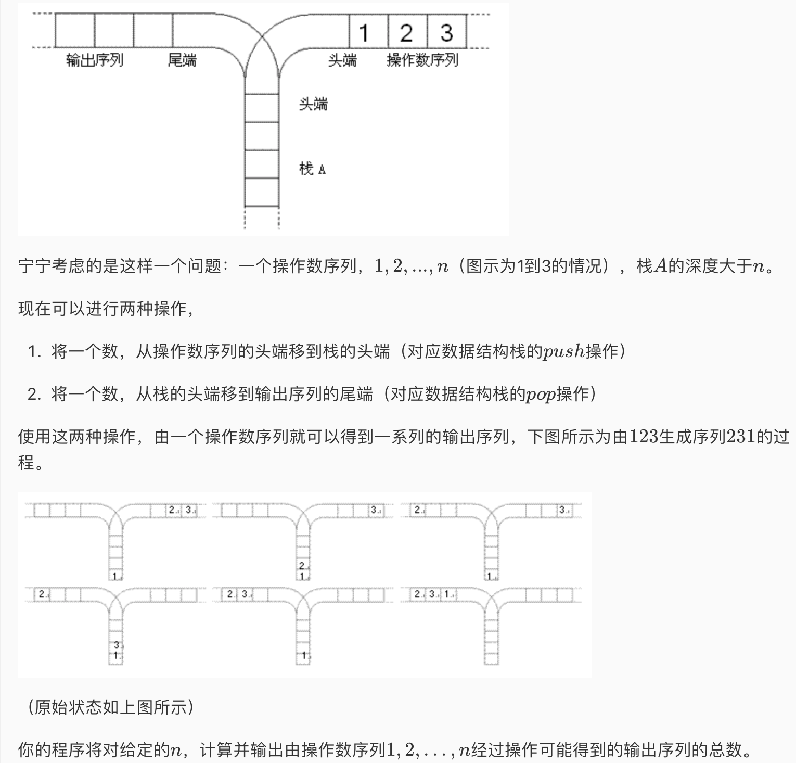

* 题目介绍

* 本题考点卡特兰数

* 分析步骤：不管前面怎么样，最后出栈的数有n种可能性（每个数都可能最后出栈），而把这n种可能性相加，也就是每个数都作为最后出栈的数加起来就能得到相应的卡特兰数 —\> 设f(n)为n个数对应的卡特兰数（也就是n个进栈序列对应的出栈序列的可能性个数）—\> 设最后出栈的数为k，比k小的数必定在k之前出栈，这些比k小的数出栈形成的序列的所有可能性为f（k-1），而所有比k大的数必定在k在栈底的时候入栈，在k之前出栈，这一部分比k大的数形成的出栈序列的所有可能性为f（n-k），这些比k大的数形成的序列与刚刚比k小的数形成的序列是相互独立的，因此把这两部分的可能性相乘就可以得到k最后出栈的所有可能性，即f（k-1）\* f（n-k），又因为n个数都可能作为最后出栈的数，所以完整的表达式为f（n）= f[0]\*f[n-1] + f[1]\*f[n-2] + ... + f[n-1]\*f[0];

* 具体的计算利用f（0） = 1 f（1） = 1 来进行递推