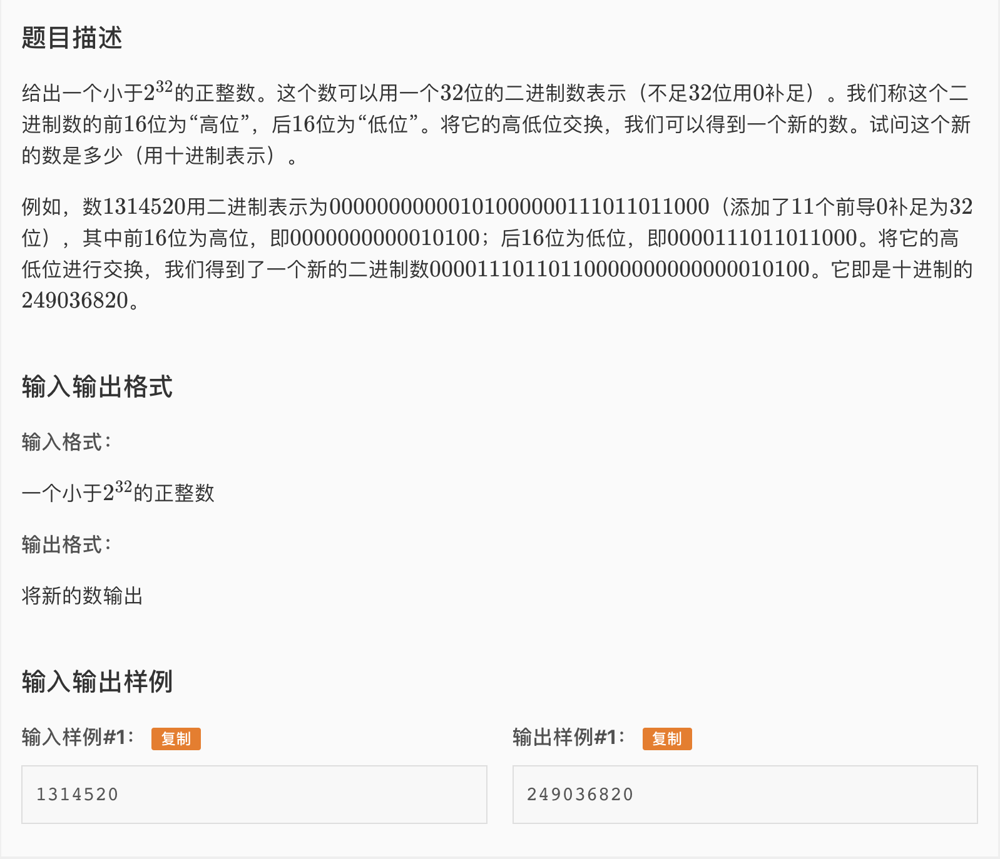

* 一道进制和位运算的水题。我的思路就是转成二进制，高低位交换，再转化回来。但是看到了一个非常优雅的题解。注意二进制中的16位就是16进制的4位。所以可以用两个16进制数就能搞定。

* 我的AC 代码

```c
#include <iostream>
#include <cstring>
#include <deque>
#include <cstdio>
#define lli long long int

using namespace std;
lli n;
lli ans;
deque<int> v;


int main(){
	scanf("%lld", &n);
  
	while(n){
		v.push_front(n&1);
		n >>= 1;
	}
	for(int i = v.size(); i < 32; ++i){
		v.push_front(0);
	}

	for(int j = 16; j <= 31; j++){
		ans <<= 1;
		ans += v[j];
	}
	for(int i = 0; i <= 15; i++){
		ans <<= 1;
		ans += v[i];
	}

	

	cout << ans;
	return 0;
}
```

* 来自洛谷用户HenryHuang的优雅题解

```c
#include<cstdio>
#include<iostream>
using namespace std;
int main()
{
    unsigned long long x;
    cin>>x;
    cout<<((x&0x0000ffff)<<16|(x&0xffff0000)>>16)<<endl;//万无一失的做法
}
```