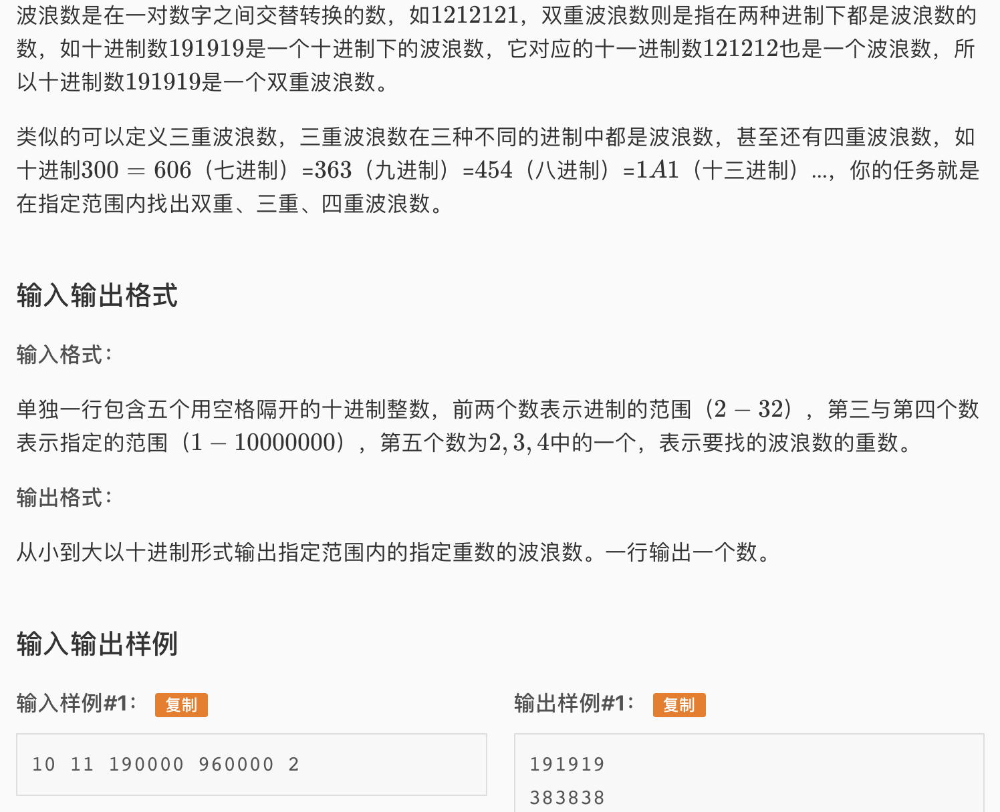

* 这道题如果用穷举是会超时的，需要把范围内的每个数转换成每个进制，再在每个进制下验证是否是波浪数。所以这道题用到了一个思想 — 构造。
* 什么是构造呢？假设题目让我们做的事是：我现在需要一个针，这个针在大海里，你去把它找来，那么构造的思想就是：干脆不大海捞针了，自己锻造出所有可能的大小形状的针，看看题目需要哪一款，然后把那支针交给题目就可以了。这道题就是这样，用穷举法寻找多重波浪数无异于大海捞针，是不现实的。所以我们干脆构造出所有可能的波浪数，然后看看哪些符合重数要求（看看题目需要哪一款），然后把符合要求的波浪数return就可以。那么这道题目的代码就变成了锻造针的过程。
* 具体算法
  * 我们用一个数组q储存范围内所有的数的重数。然后开始构造：在范围内每个进制下，用两个变量j k代表第一和第二个数，然后交替往后添加这两个数，每添加一位都看看对应的10进制数是否还在范围内，如果在就把q数组中的重数+1，如果超出了范围就跳出当前循环，开始用另一对j k构造。
  * 最后遍历q数组，把重数符合要求的打印出来即可

* AC 代码

```c
#include <iostream>
#include <cstdio>
#include <algorithm>
#include <vector>
#include <set>
#include <cstring>

using namespace std;

int s,t,a,b,d,x,c, q[10000005];

void init(){
	scanf("%d%d%d%d%d",&s, &t, &a, &b, &d);
}


int main(){
	init();
	for(int i = s; i <= t; i++){
		//在每个进制下构造波浪数 jkjkjkjk....
		for(int j = 1; j <= i-1; j++){
			//显然, 第一个数不能为0
			for(int k = 0; k <= i-1; k++){
				//第二个数可以为0
				if(j != k){
					//x储存构造出的i进制波浪数对应的10进制下的数
					//c用来交替后缀j k
					x = 0; c = 0;
					while(x <= b){
						if(c%2 == 0){
							x = x*i + j;
						}else{
							x = x*i + k;
						}
						c++;
						//判断是否在范围内
						if(x>=a && x <= b) q[x]++;
					}
				}
			}
		}
	}
	//遍历，查看满足重数的数
	for(int i = a; i <= b; i++){
		if(q[i] == d) cout << i << endl;
	}
	return 0;
}
```