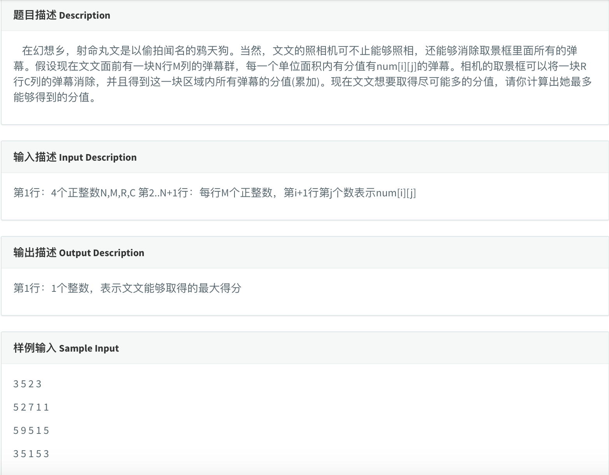

* 这是一道二维前缀和的题目，要求的是一个矩阵中大小为r\*c的子矩阵的和的最大值。

* 什么叫前缀和？这是一个很好理解的概念，对于一维数组来说，就是用另一个数组储存原始数据到第i位的加和。比如
  * 原始数据 1 5 3 2 6
  * 前缀和 1 6 9 11 17
  * 计算方法很简单，就是从前往后跑，第i位等于原始数组第i位加上前缀和第i-1位
* 什么叫二维前缀和呢？顾名思义就是二维数组的前缀和，思想和一维前缀和是一样的：我们用另一个二维数组，第i j位储存原始矩阵从[0][0]到[i][j]子矩阵的加和。这里计算方法涉及到一步容斥定理，就是我们用前缀和数组左边和上边两个数加的时候，两个子矩阵重叠部分加了两遍，要减去，这其实很简单，就像最简单的Venn图那样。不多说，直接上代码吧。

* AC 代码

```c
#include <iostream>
#include <cstdio>
#include <algorithm>
#include <cstring>
#define maxn 1005

using namespace std;
//a原始数据 s前缀和 ans答案
int a[maxn][maxn], s[maxn][maxn],n,m,r,c,ans;

//读取	
void init(){
	scanf("%d%d%d%d", &n, &m, &r, &c);
	for(int i = 0; i < n; i++){
		for(int j = 0; j < m; j++){
			int t; scanf("%d", &t);
			a[i][j] = t;
		}
	}
}

void psum(){
	/*计算前缀和*/
	//base case;
	s[0][0] = a[0][0];
	for(int i = 1; i < m; i++){
		s[0][i] = a[0][i] + s[0][i-1];
	}
	for(int i = 1; i < n; i++){
		s[i][0] = a[i][0] + s[i-1][0];
	}
	//compute first 2d pre-sum
	for(int i = 1; i < n; i++){
		for(int j = 1; j < m; j++){
			s[i][j] = a[i][j] + s[i-1][j] + s[i][j-1] - s[i-1][j-1];
		}
	}


	/*计算最大rxc子矩阵和*/
	ans = -1;
	//compute seconde 2d pre-sum
	for(int i = r-1; i < n; i++){
		for(int j = c-1; j < m; j++){
		  /*判断条件防止越界*/
			if(i-r >= 0 && j-c >= 0){
			  //对于第一大行
				ans = max(ans,s[i][j] - s[i-r][j] - s[i][j-c] + s[i-r][j-c]);
			}else if(i-r >= 0){
			  //对于第一大列
				ans = max(ans, s[i][j] - s[i-r][j]);
			}else if(j-c >= 0){
			  //对于内部
				ans = max(ans, s[i][j] - s[i][j-c]);
			}else{
			  //对于第一个r x c矩阵
				ans = max(ans,s[i][j]);
			}
		}
	}
}

int main(){
	init();
	psum();
	cout << ans;
	return 0;
}
```

