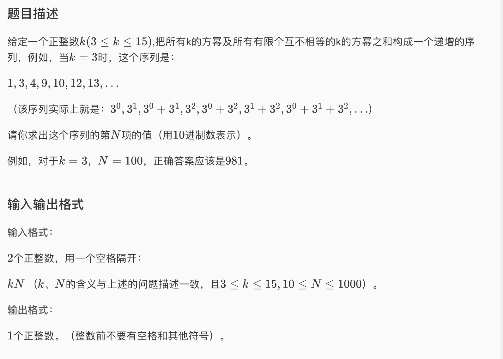

* 这道题的题解代码中有我目前见过的最优雅的进制转换，以后再遇到进制转换的问题可以当作模版
* 看到这道题我以为计算方法会很复杂，我在考虑非组合的幂的间隔有没有某种规律，找了半天没找到。其实进制的思想在我脑子中闪过了一下。因为题目描述真的很像3进制表示法。后来看了题解恍然大悟，这题的思路非常巧妙，即先把N转换成二进制，然后再把得到的二进制转换成k进制。太聪明了

* AC 代码

```c
#include <iostream>
#include <cstdio>
#include <cmath>
#include <stack>

using namespace std;
int k, N;
long long ans = 0;
stack<int> S;

int main()
{
	cin >> k >> N;
	while(N){
		S.push(N & 1); N >>= 1; 
	}
	while(!S.empty()){
		ans += S.top()*pow(k, S.size()-1); S.pop();
	}
	cout << ans;
	return 0;
}
```